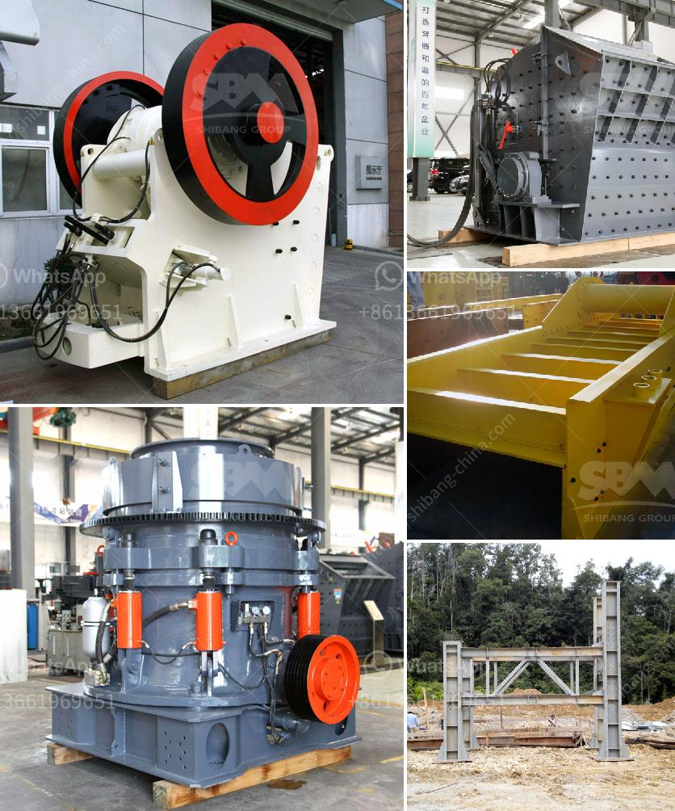

<h3>jaw crushers in harare zimbabwe</h3>
Jaw crushers are a popular crushing equipment used in the mining, metallurgy, construction, highway, railway, water conservancy and chemical industries. These jaw crushers can process up to 500 tons of material per hour and have a compressive strength of up to 320 MPa.

The unique design features of these jaw crushers enable them to efficiently perform the tasks of a typical mining and quarrying application. They have a fixed jaw plate and a moving jaw plate that work in tandem to apply pressure on the feed material, crushing it to the desired size. The crushed material is then discharged through the discharge opening.

In Harare, Zimbabwe, jaw crushers are used mainly in the mining and quarrying industry to crush raw materials into smaller particles for further processing. These crushers consist of a fixed jaw and a movable jaw, which deliver the crushing action. Jaw crushers can be classified into simple swing type jaw crushers (simple pendulum jaw crushers) and complex swing type jaw crushers (compound pendulum jaw crushers).

The simple swing type jaw crushers are widely recognized as the most economical and most widely used crushing equipment. These crushers have a simple structure and are easy to operate. They are suitable for crushing various hard and abrasive materials such as granite, basalt, iron ore, limestone, coal gangue, sandstone, and more.

On the other hand, the complex swing type jaw crushers are typically used for crushing hard and abrasive materials, and are often used as primary crushers. Compared to the simple swing type jaw crushers, the complex swing type crushers have more compact structures and are more suitable for small and medium-sized mines or quarries.

In Harare, Zimbabwe, jaw crushers are commonly used in the mining industry to break down ore into smaller sizes for further processing. Jaw crushers can be used in various applications, including mining, construction, and recycling.

When choosing a jaw crusher, it is important to consider the hardness of the material to be crushed, the feed size, the desired product size, and the capacity requirements. These factors will determine the suitable model and specifications of the jaw crusher.

Maintenance and lubrication are crucial for the proper functioning and longevity of jaw crushers. Regular inspection and maintenance of the crusher, as well as proper lubrication of the bearings, are essential to ensure smooth operation and prevent costly breakdowns.

In conclusion, jaw crushers are essential crushing equipment used in the mining and quarrying industry in Harare, Zimbabwe. They are designed to crush raw materials into smaller particles, making them easier to handle and process. When selecting a jaw crusher, it is important to consider various factors such as the material hardness, feed size, desired product size, and capacity requirements. Regular maintenance and lubrication of the crusher are essential for optimal performance and longevity.
<h3>Contact us</h3><ul><li><strong>Whatsapp:&nbsp;<a href="https://wa.me/8613661969651">+8613661969651</a></strong></li><li><a href="https://swt.shibang-china.com/?git&amp;zhl&amp;jaw crushers in harare zimbabwe"><strong>Online Service(chat now)</strong></a></li></ul><h3>Related</h3><ul><li><a href='kaolin processing equipment.md'>kaolin processing equipment</a></li><li><a href='limestone crushing equipment.md'>limestone crushing equipment</a></li><li><a href='concrete crushing machine cost.md'>concrete crushing machine cost</a></li><li><a href='quartz stone cruher process.md'>quartz stone cruher process</a></li><li><a href='sand stone crusher.md'>sand stone crusher</a></li></ul>