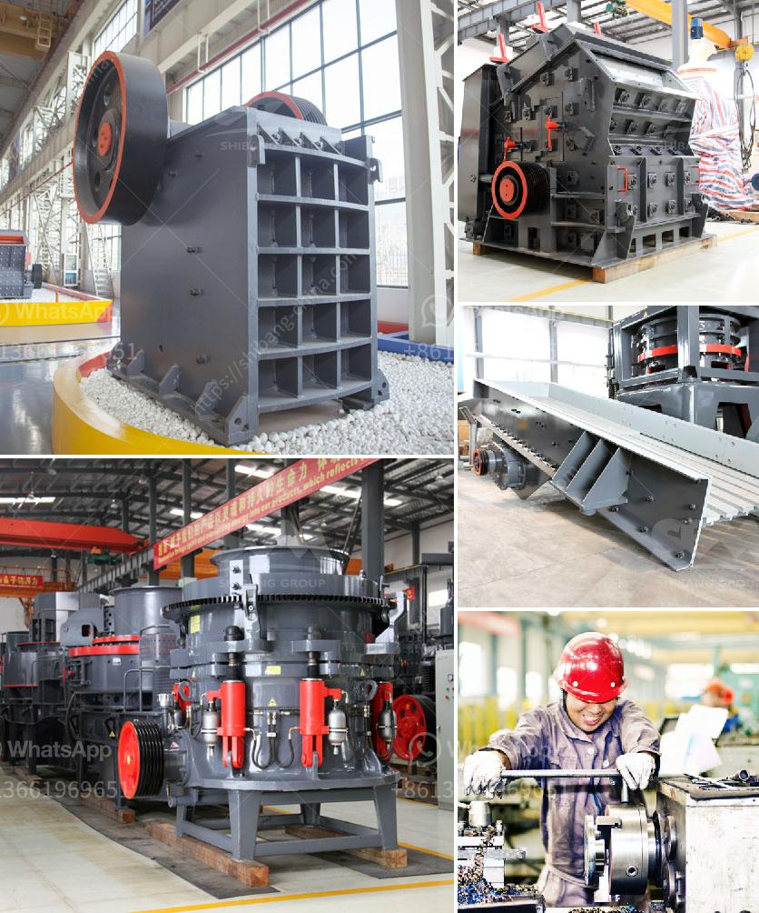

<h3>jaw crushers tungsten carbide powder</h3>
Jaw crushers are commonly used in the mining and construction industry due to their ability to crush hard materials such as ores and minerals. Tungsten carbide powder is made from tungsten carbide, a compound that contains tungsten and carbon atoms. This powder is commonly used in the production of various industrial tools and equipment, including jaw crushers.

Tungsten carbide is known for its high strength and excellent wear resistance properties. It is one of the hardest materials known to man, second only to diamonds. This makes it an ideal choice for manufacturing tools and equipment that are subjected to heavy wear and tear, such as jaw crushers.

Jaw crushers are designed to break down large rocks into smaller, more manageable pieces. They are commonly used in the mining industry, where ore is extracted from the earth and then crushed to produce minerals and metals. Tungsten carbide powder is often used to coat the jaws of these crushers, giving them enhanced durability and wear resistance.

By using tungsten carbide powder in the construction of jaw crushers, manufacturers can significantly increase the lifespan of the equipment. This is due to the material's unique properties, such as its extreme hardness and ability to withstand heavy impact and abrasive forces. These properties make tungsten carbide powder an excellent choice for applications where wear and tear are a concern.

In addition to improved durability, jaw crushers coated with tungsten carbide powder also offer better performance. The hard and wear-resistant nature of the material allows for improved crushing capacity, as the crushers can handle tougher materials with ease. This results in a more efficient and productive operation, with increased throughput and reduced downtime.

Furthermore, the use of tungsten carbide powder in jaw crushers can also reduce maintenance costs. Due to its superior wear resistance, the coated jaws require less frequent replacement, reducing the need for costly downtime and replacement parts. This translates to significant savings for operators and improves the overall profitability of the operation.

In conclusion, the use of tungsten carbide powder in jaw crushers offers numerous benefits for the mining and construction industry. The material's exceptional hardness and wear resistance properties make it an ideal choice for enhancing the durability and performance of crushers. Additionally, it reduces maintenance costs and improves the overall profitability of the operation. With these advantages, it is no wonder that tungsten carbide powder is widely used in the production of jaw crushers, ensuring that they remain an indispensable tool in the mining and construction industry.
<h3>Contact us</h3><ul><li><strong>Whatsapp:&nbsp;<a href="https://wa.me/8613661969651">+8613661969651</a></strong></li><li><a href="https://swt.shibang-china.com/?git&amp;zhl&amp;jaw crushers tungsten carbide powder"><strong>Online Service(chat now)</strong></a></li></ul><h3>Related</h3><ul><li><a href='rod mill manufacturer in europe.md'>rod mill manufacturer in europe</a></li><li><a href='mobile crusher 150 tons capacity.md'>mobile crusher 150 tons capacity</a></li><li><a href='process flow diagram for kaolin calcining using kiln.md'>process flow diagram for kaolin calcining using kiln</a></li><li><a href='jaw crusher terminator.md'>jaw crusher terminator</a></li><li><a href='consultants to help to start a stone crusher.md'>consultants to help to start a stone crusher</a></li></ul>