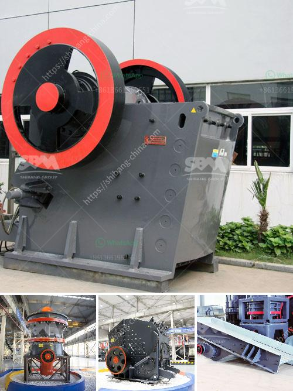

<h3>jaw crushers zimbabwe</h3>
Jaw crushers are indispensable equipment in the mining and construction industry. These crushers play an indispensable role in the mining and processing of materials, whether they are geological materials such as rocks, granite, or building aggregates such as sand and gravel. In Zimbabwe, jaw crushers are widely used in the mining industry due to their simple structure, robustness, and reliable operation.

One of the main reasons why jaw crushers are particularly beneficial in Zimbabwe is their ability to handle a wide range of materials. Zimbabwe has rich mineral resources, including gold, chrome, iron ore, coal, and diamonds. These materials require different crushers for processing. Fortunately, jaw crushers can efficiently crush these materials and convert them into more manageable sizes for further use.

Another significant advantage of jaw crushers in Zimbabwe is their high efficiency. Jaw crushers have a large feed opening and a deep crushing chamber, which allows them to process large volumes of material and extract more valuable minerals compared to other crushers. This increases productivity and ensures a higher return on investment for mining companies operating in Zimbabwe.

In addition to their high efficiency, jaw crushers are also known for their durability. The rugged construction of these crushers enables them to withstand harsh working conditions, such as high temperatures, dust, and vibrations. This is particularly important in Zimbabwe, which has a challenging climate and harsh operating environments. The robustness of jaw crushers ensures that they can withstand these conditions and operate reliably for extended periods.

Furthermore, jaw crushers are relatively easy to maintain. With regular maintenance and appropriate care, jaw crushers can have a long lifespan, reducing the need for costly replacements. The simplicity of their design also helps in the maintenance process, as it is easier to identify and resolve any issues promptly. This makes jaw crushers a cost-effective solution for mining companies in Zimbabwe, as they can minimize downtime and optimize their operations.

Despite these advantages, it is important to acknowledge some potential limitations of jaw crushers in Zimbabwe. The main limitation is the maximum feed size that jaw crushers can handle. If the material is too large, it may not be suitable for jaw crushers and require pre-processing before entering the crusher. However, this limitation can be overcome by using secondary crushers or different types of crushers specifically designed for larger feed sizes.

In conclusion, jaw crushers are essential equipment in Zimbabwe's mining industry. Their ability to handle a wide range of materials, high efficiency, durability, and easy maintenance make them indispensable for extracting and processing minerals. Despite some limitations, jaw crushers offer significant advantages that contribute to the growth and development of Zimbabwe's mining sector.
<h3>Contact us</h3><ul><li><strong>Whatsapp:&nbsp;<a href="https://wa.me/8613661969651">+8613661969651</a></strong></li><li><a href="https://swt.shibang-china.com/?git&amp;zhl&amp;jaw crushers zimbabwe"><strong>Online Service(chat now)</strong></a></li></ul><h3>Related</h3><ul><li><a href='m sand manufacturing project report.md'>m sand manufacturing project report</a></li><li><a href='wet ball mills manufacturers.md'>wet ball mills manufacturers</a></li><li><a href='fine grinding mill for sale.md'>fine grinding mill for sale</a></li><li><a href='ethiopia conveyor belts china.md'>ethiopia conveyor belts china</a></li><li><a href='copper ore processing plants in pakistan.md'>copper ore processing plants in pakistan</a></li></ul>