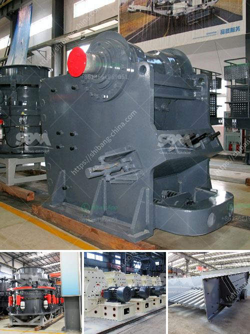

<h3>jual crusher batubara di indonesia</h3>
Pertumbuhan ekonomi yang tinggi dan berkembangnya sektor industri di Indonesia telah mendorong meningkatnya kebutuhan akan sumber daya energi yang memadai. Di antara sumber daya energi yang melimpah di Indonesia, batubara menjadi salah satu bahan bakar yang penting dan memberikan kontribusi besar dalam memenuhi kebutuhan energi nasional. Untuk mempertahankan dan memajukan industri batubara di Indonesia, jual crusher batubara di Indonesia merupakan langkah yang strategis untuk meningkatkan efisiensi produksi.

Industri batubara di Indonesia bukan hanya mencakup eksplorasi dan penambangan, tetapi juga melibatkan proses pengolahan dan distribusi yang efisien. Crusher batubara memiliki peran penting dalam memproses batubara mentah menjadi ukuran yang sesuai untuk kebutuhan industri, seperti batubara pulverized untuk pembangkit listrik tenaga batubara, atau batubara padat yang digunakan sebagai bahan bakar alternative bagi industri yang membutuhkan panas tinggi dan intensif.

1. Meningkatkan Efisiensi Produksi: Dengan menggunakan crusher batubara yang efisien, industri batubara dapat meningkatkan produktivitas dan efisiensi produksi. Crusher batubara modern dilengkapi dengan teknologi canggih yang memungkinkan operasi yang lebih cepat, lebih akurat, dan menghasilkan batubara menjadi ukuran yang diinginkan.

2. Peningkatan Kualitas Batubara: Crusher batubara memainkan peran penting dalam pemrosesan batubara dengan cara yang tidak hanya menghasilkan ukuran yang sesuai, tetapi juga dapat memisahkan batubara dari bahan lain yang tidak diinginkan. Hal ini membantu menjaga kualitas batubara yang diolah, memastikan bahwa hanya batubara berkualitas tinggi yang dapat dijual ke pasar, meningkatkan daya saing industri batubara di Indonesia.

3. Mendorong Pengembangan Teknologi: Permintaan akan crusher batubara yang efisien mendorong pengembangan teknologi yang lebih maju. Produsen crusher batubara di Indonesia terus melakukan inovasi untuk menghasilkan mesin yang lebih hemat energi, ramah lingkungan, dan dapat menghasilkan produk berkualitas tinggi secara konsisten.

4. Pemenuhan Kebutuhan Pasar: Permintaan batubara di Indonesia terus meningkat seiring dengan pertumbuhan sektor industri. Jual crusher batubara di Indonesia memastikan pasokan batubara berkualitas dengan ukuran yang sesuai untuk memenuhi kebutuhan pasar dalam negeri maupun ekspor.

Jual crusher batubara di Indonesia memegang peranan penting dalam memajukan industri batubara dan energi nasional secara keseluruhan. Dengan memastikan pengolahan batubara yang efisien dan berkualitas, Indonesia dapat memenuhi kebutuhan energi dalam negeri dan memperkuat posisi sebagai salah satu produsen batubara terbesar di dunia.

Melalui upaya pembangunan teknologi dan peningkatan kualitas produksi, jual crusher batubara di Indonesia akan berdampak positif terhadap pertumbuhan industri batubara serta meningkatkan kontribusi sektor ini terhadap pertumbuhan ekonomi nasional. Dengan adanya dukungan yang kuat dari pemerintah dan para pemangku kepentingan, industri batubara di Indonesia dapat terus tumbuh dan menjadi sumber daya energi yang berkelanjutan dan ramah lingkungan.
<h3>Contact us</h3><ul><li><strong>Whatsapp:&nbsp;<a href="https://wa.me/8613661969651">+8613661969651</a></strong></li><li><a href="https://swt.shibang-china.com/?git&amp;zhl&amp;jual crusher batubara di indonesia"><strong>Online Service(chat now)</strong></a></li></ul><h3>Related</h3><ul><li><a href='simple stone crushers kenya.md'>simple stone crushers kenya</a></li><li><a href='crusher for pozzuolana.md'>crusher for pozzuolana</a></li><li><a href='mobile crusher track.md'>mobile crusher track</a></li><li><a href='pebble stone crusher.md'>pebble stone crusher</a></li><li><a href='mobile tracked crushers.md'>mobile tracked crushers</a></li></ul>