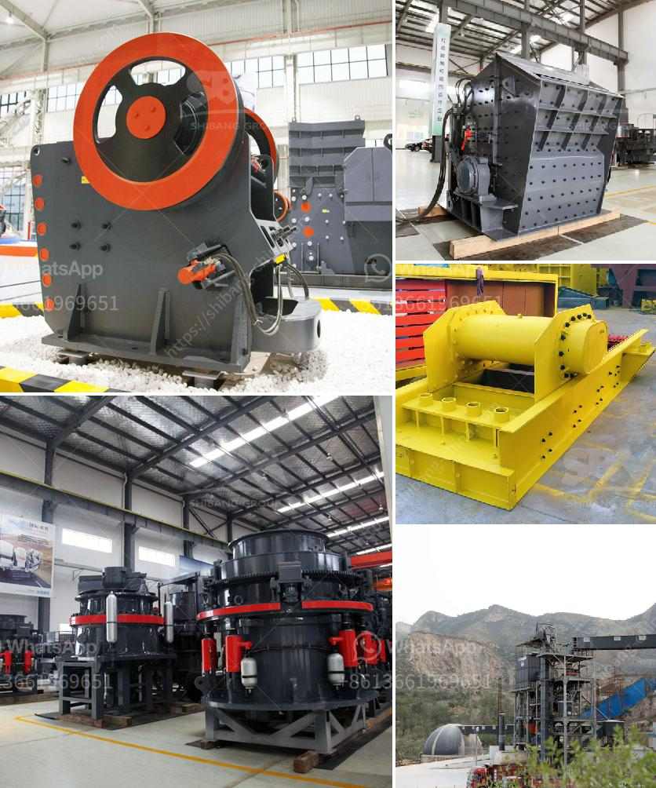

<h3>jual jaw crusher second hand</h3>
Crushing stones has been one of the main objectives for many industries since decades. Not only for construction purposes, but also for other needs, such as on railroad tracks, making concrete, and even glass. The industrial revolution has brought to us modern machines that perform this task effortlessly. Among the many machines that have been developed for this purpose, the jaw crusher stands out.

A jaw crusher is a type of primary crusher used in mines and ore processing plants. Jaw crushers are designed to crush the toughest materials through the use of compressive force (pressure). The jaw crusher design includes a set of two vertical jaws—a fixed (stationary) jaw and a swing (reciprocating) jaw. The swing jaw moves back and forth by a cam or pitman mechanism, acting like a nutcracker, to crush the rock.

Jual jaw crusher second hand is a reliable and trusted solution for crushing rocks and materials, mining sites and other industries for efficient and affordable crushing. This stone crusher has been meticulously designed to perform reliably and efficiently wherever it is used in various sectors such as in smelting and construction industries, basalt and glass industries, cement, quarry, and other applications.

When considering the purchase of a jaw crusher, many factors come into play. First and foremost, finding a trusted and reliable supplier is crucial. The supplier should have a proven track record of providing high-quality, second-hand equipment. It is always recommended to thoroughly examine the condition of the jaw crusher, ensuring that it is free from any defects or damages.

The second-hand market for jaw crushers is extensive, and the range of models and brands is vast. Buyers should make sure to narrow down their requirements and search for a jaw crusher that fits their needs. Popular brands such as Metso, Sandvik, Terex, Kleemann, and Powerscreen offer a wide range of jaw crushers, ensuring there is a suitable model for every buyer.

In the second-hand market, jaw crushers can be found in various conditions. Some of them are almost new, while others may require significant repairs. It is essential to assess the condition of a second-hand jaw crusher before making a purchase, as it may influence the overall cost and efficiency of the machine.

Advantages of opting for a second-hand jaw crusher include cost savings and reduced lead time for delivery and commissioning. In addition, a second-hand crusher allows buyers to have access to a wide range of models and brands without having to wait for the manufacturing process.

In conclusion, jual jaw crusher second hand can be an excellent option for buyers considering purchasing a reliable, efficient, and affordable crushing equipment. With careful consideration and evaluation, buyers can find second-hand jaw crushers that meet their specific needs and requirements. From mining sites to construction industries, a second-hand jaw crusher can prove to be a valuable asset in various applications. So, if you are looking to crush stones or materials efficiently, consider opting for a reliable second-hand jaw crusher that guarantees top performance.
<h3>Contact us</h3><ul><li><strong>Whatsapp:&nbsp;<a href="https://wa.me/8613661969651">+8613661969651</a></strong></li><li><a href="https://swt.shibang-china.com/?git&amp;zhl&amp;jual jaw crusher second hand"><strong>Online Service(chat now)</strong></a></li></ul><h3>Related</h3><ul><li><a href='used silica sand washing plant for sale.md'>used silica sand washing plant for sale</a></li><li><a href='coal wash plant indonesia.md'>coal wash plant indonesia</a></li><li><a href='rotary kiln manufacturers.md'>rotary kiln manufacturers</a></li><li><a href='bhel coal mill spares manufacturers.md'>bhel coal mill spares manufacturers</a></li><li><a href='gold hammer mill used for sale in zimbabwe.md'>gold hammer mill used for sale in zimbabwe</a></li></ul>