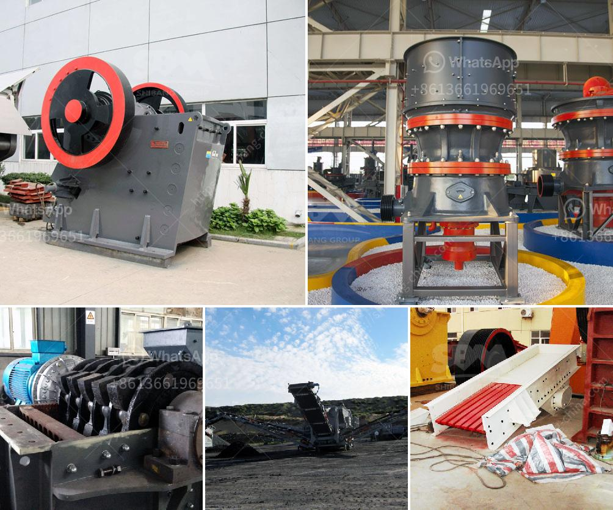

<h3>jual stone crusher philippines</h3>
When it comes to expanding your infrastructure or building a new one, one of the most critical requirements is construction materials. To help you with this, we at XYZ Company offer a wide range of stone crushing machines to effectively meet your project's needs. Our jual stone crusher Philippines is versatile and powerful enough to crush and reduce the size of different construction materials, such as granite, limestone, concrete, and asphalt.

Stone crushing machines are essential equipment in the construction industry, as they reduce large rocks into smaller, more manageable sizes. These smaller rocks can then be used as raw material for various construction projects, such as roads, highways, bridges, buildings, and even railways. Investing in a jual stone crusher Philippines is a wise choice, especially if you're in the construction industry.

The different types of stone crushers available in the market can be broadly categorized into cone crushers, jaw crushers, and impact crushers. Each type has its unique specifications and features, but they all work towards reducing the size of stones and rocks into smaller and more manageable pieces. Depending on your project's requirements, you can choose the appropriate type of stone crusher.

Cone crushers are ideal for crushing rocks and stones with high hardness and abrasive index. They operate by compressing the material between a moving cone and a stationary cone. This crushing action results in a finer product size, making it suitable for various construction purposes. Some of our high-performance cone crushers come with hydraulic adjustment capabilities, allowing you to achieve a precise product size.

On the other hand, jaw crushers are widely used in the construction industry for primary crushing purposes. These crushers work by applying pressure to the material, which gets crushed between two plates. With their sturdy construction and reliability, jaw crushers are suitable for processing various types of stones, including the hardest ones.

Lastly, impact crushers are designed to provide precise and quick crushing action. They work by propelling rocks and stones against a solid surface, causing them to break and reduce in size. Our impact crushers are equipped with adjustable aprons and hammers, allowing you to control the size and shape of the final product. This flexibility makes them suitable for a wide range of construction applications.

Aside from the type of stone crusher, it's also essential to consider other factors when purchasing one. These include the crushing capacity, power consumption, maintenance requirements, and operating costs. Our jual stone crusher Philippines offers excellent performance, durability, and user-friendly controls, ensuring an efficient and reliable crushing process.

In conclusion, investing in a jual stone crusher Philippines is a cost-effective and practical solution for your construction needs. Whether you're involved in building infrastructure or need materials for other projects, our versatile and powerful stone crushing machines can help you achieve the desired results. Contact XYZ Company today and let us assist you in finding the perfect stone crusher for your project.
<h3>Contact us</h3><ul><li><strong>Whatsapp:&nbsp;<a href="https://wa.me/8613661969651">+8613661969651</a></strong></li><li><a href="https://swt.shibang-china.com/?git&amp;zhl&amp;jual stone crusher philippines"><strong>Online Service(chat now)</strong></a></li></ul><h3>Related</h3><ul><li><a href='quarry crusher plant machinery.md'>quarry crusher plant machinery</a></li><li><a href='used crushing plant for sale.md'>used crushing plant for sale</a></li><li><a href='small mobile limestone crushers.md'>small mobile limestone crushers</a></li><li><a href='turkey cement mill plant for sale.md'>turkey cement mill plant for sale</a></li><li><a href='impact crusher for sale in kenya.md'>impact crusher for sale in kenya</a></li></ul>