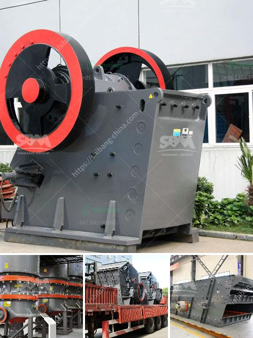

<h3>jual stone crusher plant kredit</h3>
The construction industry has witnessed significant growth in recent years, and this trend is expected to continue in the coming years. With infrastructure development projects taking place worldwide, the demand for construction materials has also surged. Among these materials, crushed stones are essential for various applications, including road construction, building foundations, and landscaping.

To meet this increasing demand, stone crusher plants have become essential in the construction industry. These plants are designed to crush and process stones into smaller sizes, making them suitable for different construction purposes. However, the high cost of purchasing a stone crusher plant can be a major obstacle for small and medium-sized construction firms.

Thankfully, there is an alternative solution available for those who can't afford to purchase a stone crusher plant upfront. Jual stone crusher plant kredit offers a convenient and flexible option for businesses to acquire these essential machines on credit. This arrangement allows construction firms to start using the plant immediately while paying for it in installments over a specific period.

One of the primary benefits of opting for jual stone crusher plant kredit is that it eliminates the need for substantial upfront capital investment. This can be particularly helpful for small construction firms or those starting their operations. By spreading the cost over time, businesses can allocate their financial resources more efficiently and focus on other aspects of their projects.

Additionally, jual stone crusher plant kredit provides companies with an opportunity to test the efficiency and effectiveness of the machine without committing to a full purchase. This allows businesses to evaluate the performance and suitability of the plant for their specific needs before making a long-term investment. It also reduces the risks associated with investing in a machine that may not meet the desired requirements.

Another advantage of jual stone crusher plant kredit is the availability of various financing options. Companies can choose from a range of repayment terms and interest rates that best suit their financial capabilities. This flexibility ensures that the repayment schedule aligns with the company's cash flow, making it easier to manage the financial obligations without straining the company's budget.

Furthermore, jual stone crusher plant kredit often comes with additional services and support. Some suppliers may offer maintenance, training, and technical assistance to ensure the smooth operation of the plant. This added value can significantly benefit construction firms, especially those without prior experience in managing and maintaining such equipment.

In conclusion, jual stone crusher plant kredit offers an easy and affordable solution for construction firms in need of a stone crusher plant. By opting for this credit-based arrangement, businesses can overcome the financial barriers associated with purchasing the machinery upfront. It allows them to acquire the equipment immediately, evaluate its performance, and spread the cost over time in manageable installments. With such flexibility and convenience, jual stone crusher plant kredit proves to be a smart choice for construction companies of all sizes.
<h3>Contact us</h3><ul><li><strong>Whatsapp:&nbsp;<a href="https://wa.me/8613661969651">+8613661969651</a></strong></li><li><a href="https://swt.shibang-china.com/?git&amp;zhl&amp;jual stone crusher plant kredit"><strong>Online Service(chat now)</strong></a></li></ul><h3>Related</h3><ul><li><a href='gold mining equipment in south africa for sale.md'>gold mining equipment in south africa for sale</a></li><li><a href='50tph stone crusher in germany for sale.md'>50tph stone crusher in germany for sale</a></li><li><a href='iron crushing equipment cost.md'>iron crushing equipment cost</a></li><li><a href='iron slag crushing ball mill price.md'>iron slag crushing ball mill price</a></li><li><a href='grinding of limestone for cement production.md'>grinding of limestone for cement production</a></li></ul>