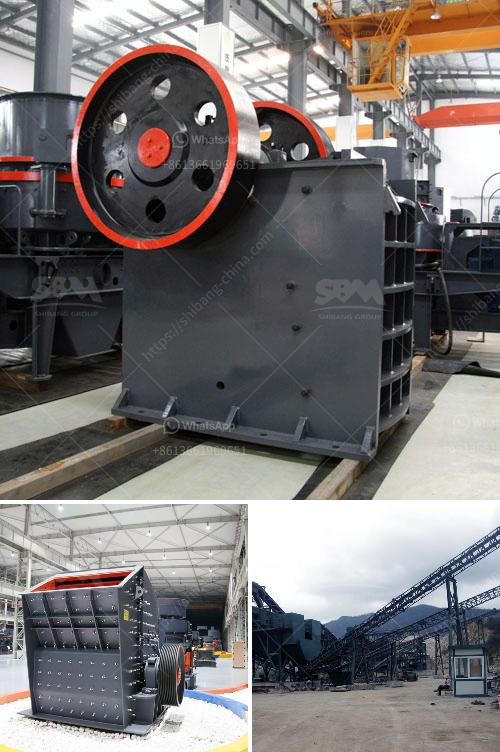

<h3>kaolin calcination equipment</h3>
Kaolin is a common white clay mineral that has a wide range of applications in various industries such as ceramics, paper, rubber, paint, and cosmetics. To enhance its properties and expand its applications, kaolin needs to undergo a process called calcination. This process involves heating the kaolin to high temperatures to remove impurities and increase its whiteness and particle size. To achieve efficient and high-quality kaolin calcination, specialized equipment is required.

One of the essential pieces of equipment used in kaolin calcination is a rotary kiln. This equipment consists of a rotating cylinder with a slight incline, through which kaolin is fed in at one end while hot air or gas is blown in at the other end. The material gradually moves from one end to the other, undergoing various physical and chemical transformations along the way. The rotary kiln provides the necessary heat and conditions for the kaolin to undergo the calcination process.

Another essential piece of equipment used in kaolin calcination is a calciner. A calciner is a separate chamber within a kiln where kaolin is subjected to controlled high temperatures. This equipment allows for precise control of the calcination process, ensuring optimal results. Calciners can operate under different conditions such as direct or indirect heating, depending on the specific requirements of the kaolin being processed.

In addition to rotary kilns and calciners, other auxiliary equipment is often used in kaolin calcination plants. This equipment includes feeders, crushers, classifiers, and dust collectors. Feeders are used to control the flow of kaolin into the calcination process, while crushers break down larger chunks of kaolin into smaller pieces. Classifiers help separate particles based on size, while dust collectors capture and remove any fine particles or pollutants generated during the calcination process.

The design and selection of kaolin calcination equipment are crucial for achieving desired product quality and process efficiency. Factors such as the size and purity of the kaolin, the desired particle size distribution, and the calcination temperature and residence time all play a role. Therefore, it is essential to work with experienced equipment manufacturers who can provide the necessary expertise and customize the equipment to meet specific requirements.

In recent years, advancements in kaolin calcination equipment have focused on energy efficiency and environmental sustainability. Manufacturers have developed innovative solutions to reduce energy consumption and minimize emissions generated during the calcination process. For example, the use of preheaters can help recover and reuse waste heat, reducing the overall energy demand. Additionally, advanced emission control systems and filters can capture and treat any pollutants, ensuring compliance with strict environmental regulations.

In conclusion, kaolin calcination equipment plays a critical role in enhancing the properties and expanding the applications of kaolin. Rotary kilns, calciners, and auxiliary equipment are essential components of the calcination process, providing the necessary heat, control, and conditions. Efficient and well-designed equipment can help achieve high-quality kaolin products while minimizing energy consumption and environmental impact. As the demand for kaolin continues to grow, further advancements in calcination equipment are expected, driving the industry towards improved efficiency and sustainability.
<h3>Contact us</h3><ul><li><strong>Whatsapp:&nbsp;<a href="https://wa.me/8613661969651">+8613661969651</a></strong></li><li><a href="https://swt.shibang-china.com/?git&amp;zhl&amp;kaolin calcination equipment"><strong>Online Service(chat now)</strong></a></li></ul><h3>Related</h3><ul><li><a href='technology of conveyor belts.md'>technology of conveyor belts</a></li><li><a href='to buy a second hand mobile stone crusher plant india.md'>to buy a second hand mobile stone crusher plant india</a></li><li><a href='m sand manufacturing project report.md'>m sand manufacturing project report</a></li><li><a href='mobile coal cone crusher for hire malaysia.md'>mobile coal cone crusher for hire malaysia</a></li><li><a href='how much does it cost to open a crusher stone plant.md'>how much does it cost to open a crusher stone plant</a></li></ul>