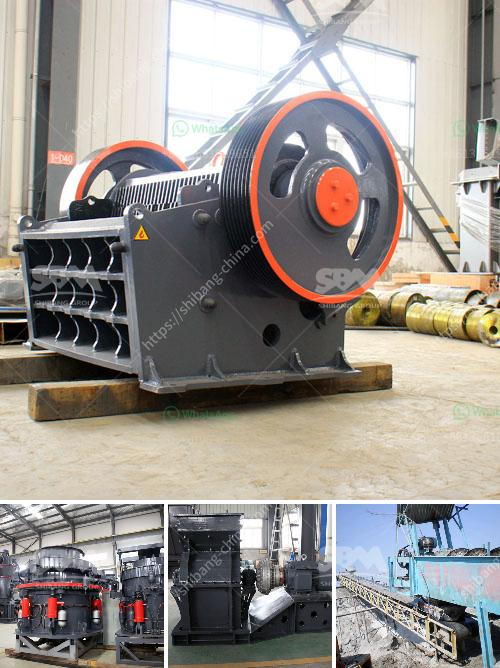

<h3>kaolin crusher machine</h3>
Kaolin, also known as china clay, is a type of soft white clay that is used extensively in the paper, paint, rubber, and ceramics industries. It is mainly composed of kaolinite, a mineral that is a hydrous aluminum silicate.

In order to process kaolin ore efficiently and maximize its economic benefits, it is crucial to choose the right kaolin crusher machine. The crushing equipment is mainly determined by the physical properties, such as the hardness, sticky nature, and moisture content of the material.

One of the popular machines for kaolin crushing is the jaw crusher. Jaw crusher can be used for coarse, medium, and fine crushing of various ores and stones. It has great processing capacity and can handle large-sized materials with high efficiency. The crushing chamber is deep and has no dead zone, which improves its feeding capacity and output.

Another commonly used kaolin crushing machine is the impact crusher. Impact crusher can process the materials with side length of 100-500mm and compressive strength up to 350Mpa. It has the advantages of large crushing ratio and cubic particles after crushing. The impact crusher is generally used for the second crushing process of kaolin.

Cone crusher is also a widely used kaolin crusher machine in the mining industry. It has the advantages of high efficiency, large crushing ratio, and low operating cost. Compared with the impact crusher, cone crusher can finely crush kaolin particles with good texture and shape.

In addition to these machines, there are also vibrating feeder, vibrating screen, belt conveyor, and other auxiliary equipment available for kaolin crushing and grinding. These machines can improve the efficiency and output of the kaolin processing plant.

In summary, choosing the right kaolin crusher machine is essential for efficient processing and maximizing economic benefits. Whether it is jaw crusher, impact crusher, cone crusher, or other machines, they all have their own advantages and can be used in different crushing scenarios. It is important to consider the specific requirements of the kaolin material and select the appropriate machine accordingly.
<h3>Contact us</h3><ul><li><strong>Whatsapp:&nbsp;<a href="https://wa.me/8613661969651">+8613661969651</a></strong></li><li><a href="https://swt.shibang-china.com/?git&amp;zhl&amp;kaolin crusher machine"><strong>Online Service(chat now)</strong></a></li></ul><h3>Related</h3><ul><li><a href='cone crushers washing system.md'>cone crushers washing system</a></li><li><a href='gold mining equipment stores in tanzania.md'>gold mining equipment stores in tanzania</a></li><li><a href='iron crushing equipment cost.md'>iron crushing equipment cost</a></li><li><a href='concrete crusher cost.md'>concrete crusher cost</a></li><li><a href='station de concasassage theniet elhad.md'>station de concasassage theniet elhad</a></li></ul>