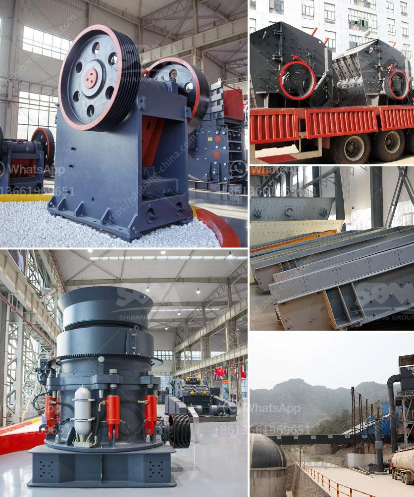

<h3>kaolin crusher processing machine</h3>
Kaolin, a mineral containing aluminum silicate, is one of the essential minerals used in various industrial sectors such as paper-making, ceramics, rubber, paint, and plastic industries. The abundance of kaolin reserves makes it necessary to have efficient equipment for its processing. One such equipment is the kaolin crusher processing machine.

The kaolin crusher processing machine is a kind of cone crusher and is typically used for the primary or secondary crushing of materials. Since it has a wide range of applications, it is used in mineral processing, industrial sectors such as kaolin, refractories, cement, limestone, granite, basalt, and other materials. The machine is designed with high crushing efficiency, low energy consumption, and uniform particle size.

The kaolin crusher processing machine consists of two fixed cones, an adjustable crushing chamber, and eccentricity. Its crushing speed and eccentricity are adjustable through the hydraulic system, which allows the machine to dislodge any materials that may cause blockages. Moreover, the machine's unique design ensures that both surfaces of the crushing chamber wear evenly, extending the service life of the equipment.

In addition, the kaolin crusher processing machine is equipped with a multi-function hydraulic station, which allows for easy operation and maintenance. The machine also comes with an advanced electronic control system that provides users with a high degree of automation. This not only improves the efficiency of the production process but also ensures the safety of the operation.

Furthermore, the kaolin crusher processing machine is environmentally friendly, as it produces less dust and noise during operation. Additionally, the machine has a small footprint, making it suitable for both fixed and mobile crushing stations. This allows for easy transportation and installation on-site.

In conclusion, the kaolin crusher processing machine is a versatile and efficient equipment that is ideal for the primary or secondary crushing of materials in the kaolin industry. Its advanced design, high crushing efficiency, and easy operation and maintenance make it a preferred choice for processing kaolin.
<h3>Contact us</h3><ul><li><strong>Whatsapp:&nbsp;<a href="https://wa.me/8613661969651">+8613661969651</a></strong></li><li><a href="https://swt.shibang-china.com/?git&amp;zhl&amp;kaolin crusher processing machine"><strong>Online Service(chat now)</strong></a></li></ul><h3>Related</h3><ul><li><a href='used crusher for sale in south africa.md'>used crusher for sale in south africa</a></li><li><a href='concrete crusher for rent qatar.md'>concrete crusher for rent qatar</a></li><li><a href='gypsum powder uses in construction.md'>gypsum powder uses in construction</a></li><li><a href='jual stone crusher plant kredit.md'>jual stone crusher plant kredit</a></li><li><a href='grinding media loading in ball mill machine.md'>grinding media loading in ball mill machine</a></li></ul>