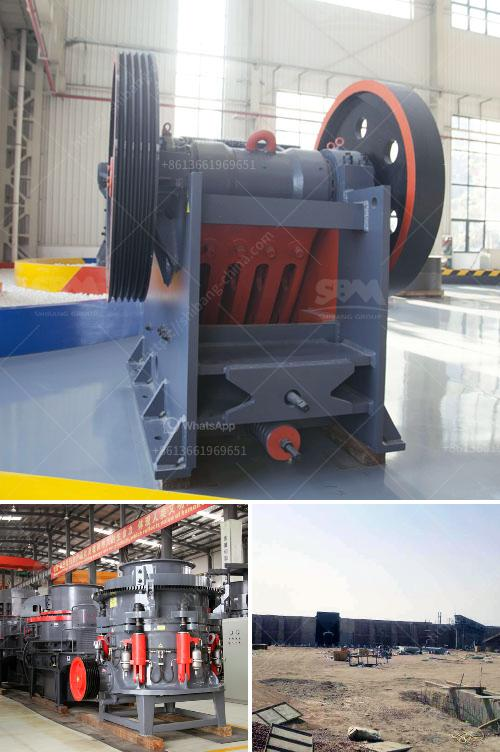

<h3>kaolin crusher production costs</h3>
Kaolin, also known as china clay, is a white, soft, and porous clay mineral primarily composed of kaolinite. It is widely used in various industries such as paper, ceramics, rubber, and paints due to its exceptional properties. The demand for kaolin is continuously growing, leading to an increase in the production of kaolin crushers.

The production of kaolin crushers involves several costs that need to be taken into consideration. These costs can be broadly categorized into two: direct costs and indirect costs. Direct costs are directly associated with the production process, while indirect costs are incurred due to supporting activities.

Direct costs of kaolin crusher production primarily include raw material costs, labor costs, energy costs, and equipment costs. Raw material costs involve the procurement of kaolin, which is the primary ingredient for making kaolin crushers. The cost of raw materials varies depending on the quality of kaolin and its availability in the market.

Labor costs are another significant component of the production costs. Skilled labor is required for the manufacturing of kaolin crushers, including operating machinery, assembling parts, and conducting quality control checks. Labor costs depend on factors such as wage rates, productivity, and the number of workers involved in the production process.

Energy costs are a crucial factor in kaolin crusher production. Energy is required to power the machinery and equipment used in the manufacturing process. The cost of energy depends on the local utility rates, efficiency of the machines, and the production volume.

Equipment costs include the purchase, maintenance, and depreciation of machinery and tools used in the production process. Kaolin crushers require specific equipment for crushing and grinding the raw material. The cost of equipment can be significant, especially if advanced technology is utilized for efficient and high-capacity production.

Besides direct costs, indirect costs also impact the overall production costs of kaolin crushers. These costs include overhead costs, administrative costs, marketing costs, and research and development costs. Overhead costs encompass expenses such as rent, utilities, insurance, and other operational expenses required to run the production facility.

Administrative costs include salaries and other expenses related to managing the production process, such as accounting, human resources, and legal support. Marketing costs involve promoting and advertising the kaolin crushers to attract customers. Research and development costs are incurred for improving the quality and efficiency of the crushers, enabling manufacturers to stay competitive in the market.

Reducing production costs is a crucial aspect for manufacturers to ensure profitability. Several strategies can be adopted to mitigate production costs. These include finding affordable and high-quality raw materials, optimizing labor utilization and productivity, investing in energy-efficient machinery, and streamlining administrative and operational processes.

In conclusion, the production costs of kaolin crushers involve direct costs, such as raw materials, labor, energy, and equipment, as well as indirect costs such as overhead, administrative, marketing, and research and development expenses. To remain economically viable, manufacturers need to find ways to minimize these costs while maintaining product quality and competitiveness in the market.
<h3>Contact us</h3><ul><li><strong>Whatsapp:&nbsp;<a href="https://wa.me/8613661969651">+8613661969651</a></strong></li><li><a href="https://swt.shibang-china.com/?git&amp;zhl&amp;kaolin crusher production costs"><strong>Online Service(chat now)</strong></a></li></ul><h3>Related</h3><ul><li><a href='differnce between raw mill and ball mill.md'>differnce between raw mill and ball mill</a></li><li><a href='50 tpd iron crusher machinery cost.md'>50 tpd iron crusher machinery cost</a></li><li><a href='cone crushers washing system.md'>cone crushers washing system</a></li><li><a href='quarry machine manufacturing company in malaysia.md'>quarry machine manufacturing company in malaysia</a></li><li><a href='the vertical mill ireland information.md'>the vertical mill ireland information</a></li></ul>