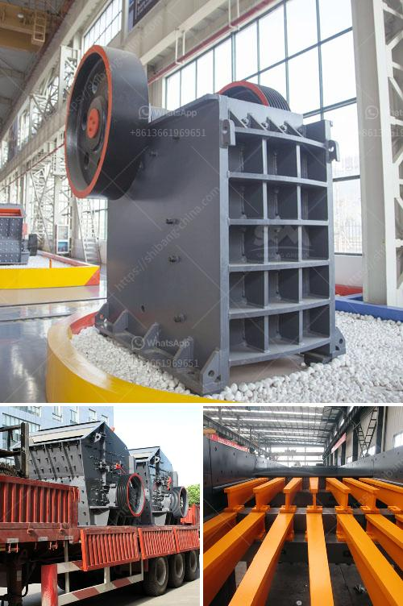

<h3>kaolin processing equipment manufacturers in germany</h3>
Kaolin, also known as china clay, is a white, soft, and plastic clay mineral mainly composed of kaolinite, which is a hydrous aluminum silicate. Kaolin is found in abundance in the earth's crust and is a common raw material used in various industrial applications, including the production of paper, ceramics, paints, rubber, plastics, and cosmetics. To efficiently process kaolin and extract valuable materials, the use of high-quality kaolin processing equipment is vital. In Germany, there are several reputable manufacturers known for their expertise in providing advanced kaolin processing solutions.

One prominent company in the kaolin processing equipment industry is Hosokawa Micron GmbH, a German establishment that was founded in 1987. With decades of experience in the powder and particle processing field, Hosokawa Micron develops and supplies innovative machines and systems tailored to the specific needs of their customers. Their expertise covers a wide range of industries, including the processing of minerals and raw materials like kaolin.

Hosokawa Micron offers a diverse range of equipment for kaolin processing, such as pulverizers, classifiers, agglomeration systems, and compactors. Their pulverizers, for instance, are designed to efficiently reduce large chunks of kaolin into fine powders with a narrow particle size distribution. This ensures consistent and high-quality output suitable for various applications. Additionally, their classifiers and compactors play a crucial role in enhancing the efficiency of the kaolin processing by separating particles based on size and consolidating them into uniform, easy-to-handle forms.

Another well-known player in the kaolin processing equipment market is AKW Equipment + Process Design GmbH, a German company founded in 1963. AKW specializes in the design, engineering, and manufacturing of innovative equipment and turnkey plants for wet mechanical and thermal processing of various minerals, including kaolin. Their solutions range from single units to complete systems, customized to meet the unique requirements of clients.

AKW’s kaolin processing equipment includes hydrocyclones, attrition scrubbers, and wet high-intensity magnetic separators, among others. The hydrocyclones separate the kaolin particles based on their size, allowing for efficient classification and separation. Attrition scrubbers, on the other hand, remove impurities and increase the brightness of the kaolin. Lastly, wet high-intensity magnetic separators are used to remove iron contaminants from the kaolin, ensuring a higher purity level.

In conclusion, Germany is home to several top-tier manufacturers of kaolin processing equipment known for their expertise in designing and supplying efficient and reliable machines. Companies like Hosokawa Micron and AKW Equipment + Process Design have decades of experience in the field and offer a wide range of equipment tailored to the specific needs of their customers. The advancements made by these manufacturers contribute to the overall efficiency and quality of the kaolin processing industry, facilitating the production of high-quality materials used in various industrial applications worldwide.
<h3>Contact us</h3><ul><li><strong>Whatsapp:&nbsp;<a href="https://wa.me/8613661969651">+8613661969651</a></strong></li><li><a href="https://swt.shibang-china.com/?git&amp;zhl&amp;kaolin processing equipment manufacturers in germany"><strong>Online Service(chat now)</strong></a></li></ul><h3>Related</h3><ul><li><a href='crushing and screening companies in south africa.md'>crushing and screening companies in south africa</a></li><li><a href='crusher for silicon quartz.md'>crusher for silicon quartz</a></li><li><a href='mobile crushing and screening plant.md'>mobile crushing and screening plant</a></li><li><a href='granite processing plant prices.md'>granite processing plant prices</a></li><li><a href='stone crushing quarry works with conveyor belt.md'>stone crushing quarry works with conveyor belt</a></li></ul>