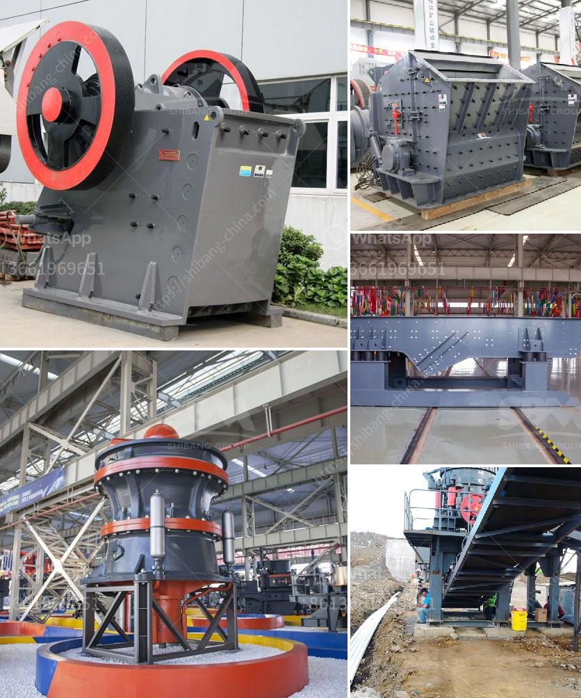

<h3>kaolin processing equipment</h3>
Kaolin, also known as china clay, is a white, soft, and plastic clay mineral that is commonly used in a variety of industries, including paper, ceramics, rubber, plastics, paint, and more. To process kaolin, the ore is first crushed and then refined through several methods, such as wet refining, calcining, and drying.

In the wet processing method, water is added to the crushed ore, creating a slurry. The slurry is then pumped into a large tank, where it is agitated to break up any clumps and impurities. Once the kaolin has been purified, it is separated from the water through various techniques, such as sedimentation, filtration, or centrifugation.

After the wet refining process, the kaolin is then subjected to calcination, a high-temperature treatment that removes any remaining water molecules and transforms the mineral into a fine, white powder. This process not only enhances the whiteness and brightness of the kaolin but also improves its overall purity and strength.

Once calcined, the kaolin powder is typically dried to reduce its moisture content. This is accomplished through various drying methods, such as air drying, spray drying, or flash drying. The dried kaolin can then be further processed to meet specific particle size requirements, whether it's for paper coating, filler applications, or as an ingredient in rubber and plastic products.

To achieve optimal kaolin processing, specialized equipment is required. High-quality kaolin processing equipment includes crushers, conveyors, and screens, as well as mills and classifiers. Some of the equipment used for kaolin in dustry includes rotary dryers, spray dryers, flash dryers, and calciners.

Overall, kaolin processing plays a crucial role in various industries, as it provides essential raw materials for numerous applications. By employing advanced processing equipment, kaolin can be refined to meet the specific requirements of different industries, ensuring the production of high-quality products.
<h3>Contact us</h3><ul><li><strong>Whatsapp:&nbsp;<a href="https://wa.me/8613661969651">+8613661969651</a></strong></li><li><a href="https://swt.shibang-china.com/?git&amp;zhl&amp;kaolin processing equipment"><strong>Online Service(chat now)</strong></a></li></ul><h3>Related</h3><ul><li><a href='mobile crushers for sale uk.md'>mobile crushers for sale uk</a></li><li><a href='renta de cribas vibratorias en mexico.md'>renta de cribas vibratorias en mexico</a></li><li><a href='portable crushing and screening plant.md'>portable crushing and screening plant</a></li><li><a href='coal washing process machine.md'>coal washing process machine</a></li><li><a href='grinding machines for minerals in indonesia.md'>grinding machines for minerals in indonesia</a></li></ul>