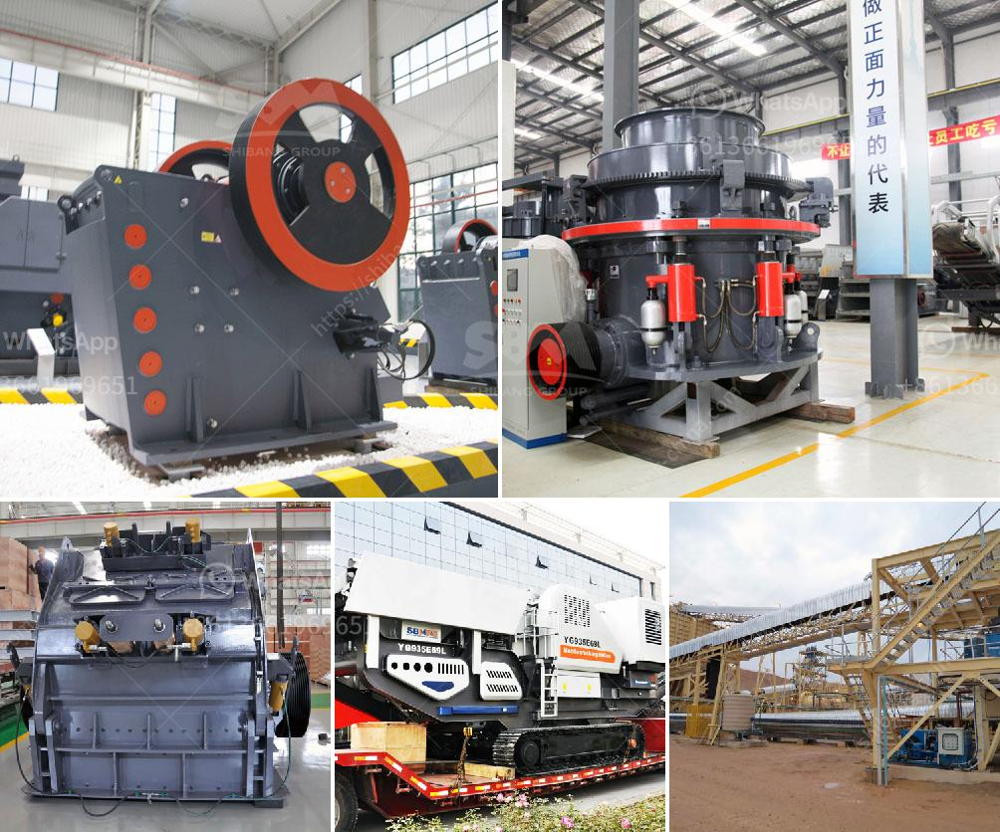

<h3>kaolin processing plant</h3>
Kaolin, also known as china clay, is a white, soft, and versatile industrial mineral. It is known for its uses in ceramics, paper, paint, and various other products. To meet the growing demand for kaolin, a kaolin processing plant has been established.

A kaolin processing plant brings the ore to the surface and separates it into a fine, powdery substance called kaolin. This kaolin can be used in various applications such as ceramics, paper making, and paint manufacturing.

The kaolin processing plant consists of a series of equipment that include a crusher, a scrubber, hydrocyclones, magnetic separators, attrition cells, and thickener facilities. The whole process is designed to remove impurities such as clay minerals, iron, titanium, and mica from the kaolin ore.

In the initial stage, the kaolin ore is crushed and sized to pass through a series of crushers. The crushed ore is then scrubbed in a scrubber, which removes any remaining impurities. After scrubbing, the ore is further processed in hydrocyclones, where the larger particles are separated from the finer kaolin particles.

The next step in the process involves magnetic separation, where magnetic particles such as iron and titanium are removed. This is followed by attrition cells, which further remove impurities. Finally, the kaolin ore is sent to thickener facilities to remove excess water and produce a concentrated kaolin product.

The processed kaolin is then used in a wide range of applications. In the ceramics industry, it is used to make porcelain, tiles, and bathroom fixtures. In the paper industry, it is used as a filler to improve the paper's smoothness and brightness. In the paint industry, it is used as a pigment and filler to enhance the paint's opacity and durability.

In conclusion, a kaolin processing plant plays a crucial role in meeting the demand for kaolin in various industries. It transforms the raw kaolin ore into a fine, powdery substance that can be used in ceramics, paper, and paint manufacturing. With the help of advanced equipment and technologies, kaolin processing plants ensure the production of high-quality kaolin products.
<h3>Contact us</h3><ul><li><strong>Whatsapp:&nbsp;<a href="https://wa.me/8613661969651">+8613661969651</a></strong></li><li><a href="https://swt.shibang-china.com/?git&amp;zhl&amp;kaolin processing plant"><strong>Online Service(chat now)</strong></a></li></ul><h3>Related</h3><ul><li><a href='stone crusher supplier in orissa.md'>stone crusher supplier in orissa</a></li><li><a href='mobile stone crushing machine for sale.md'>mobile stone crushing machine for sale</a></li><li><a href='granite stones crusher.md'>granite stones crusher</a></li><li><a href='coal processing equipment.md'>coal processing equipment</a></li><li><a href='high performance mobile crushing machine for sale.md'>high performance mobile crushing machine for sale</a></li></ul>