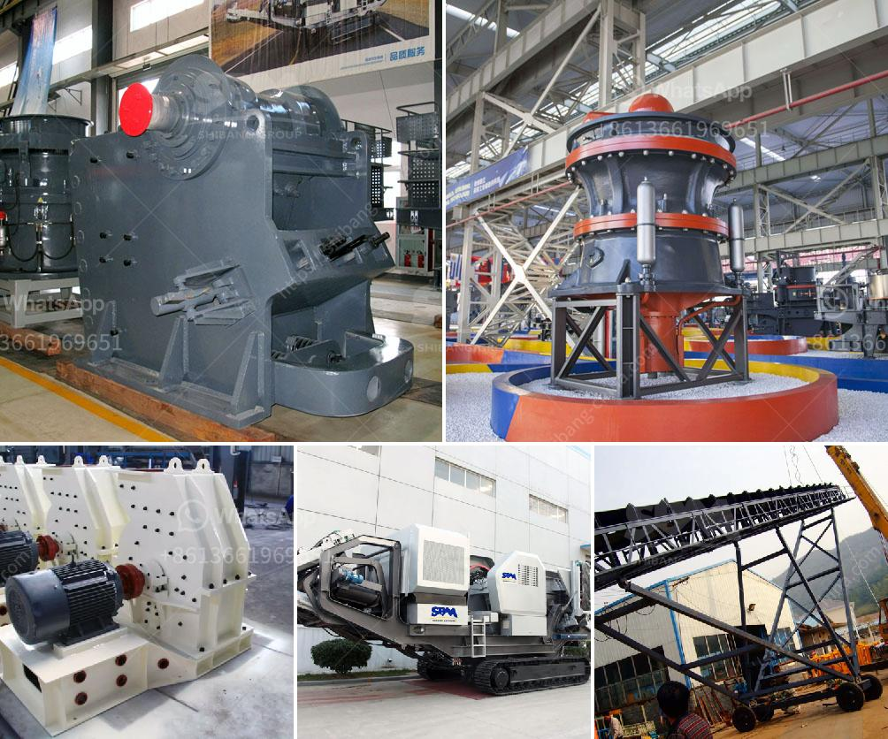

<h3>kaolin processing unit</h3>
Kaolin is a clay mineral that is found in abundance in many parts of the world. It is commonly used in various industries, including paper, ceramics, plastics, rubber, and cosmetics. The processing of kaolin involves the use of different techniques, including heating, centrifuging, bleaching, magnetic separation, and chemical treatment.

One of the most important steps in the processing of kaolin is the removal of impurities, such as iron oxide and titanium dioxide. These impurities can significantly affect the brightness and color of the final product, making it less desirable for certain applications. To remove these impurities, kaolin is usually subjected to a series of processes that include classification, flotation, and dewatering.

The first step in kaolin processing is to crush the raw kaolin material into smaller particles using various crushing equipment. These particles are then classified into different size fractions using vibrating screens. The classified kaolin is then subjected to flotation processes to remove the iron oxide and titanium dioxide impurities. In the flotation process, chemicals are added to the kaolin slurry to selectively separate these impurities from the kaolin particles. The kaolin particles, along with water, are agitated in flotation tanks, and the impurities are selectively attracted to the air bubbles, which rise to the surface and are then skimmed off.

After the flotation process, the kaolin slurry undergoes a dewatering process to reduce its water content. This can be done through centrifugation, where the kaolin slurry is spun at high speeds to separate the water from the kaolin particles. The dewatered kaolin is then dried using various drying techniques, such as rotary dryers or fluidized bed dryers, to achieve the desired moisture content.

Once the kaolin is dried, it may undergo further processing depending on its intended use. For example, if the kaolin is to be used in the paper industry, it may go through a bleaching process to improve its brightness. This involves treating the kaolin with chemicals to remove any remaining impurities and to enhance its color.

In conclusion, the processing of kaolin involves several steps to remove impurities and enhance its properties for various applications. The kaolin processing unit plays a crucial role in these processes, facilitating the efficient production of high-quality kaolin products. With advancements in technology, kaolin processing units have become more automated and sophisticated, leading to increased productivity and improved product quality. As the demand for kaolin continues to grow, the development of advanced processing units will further contribute to the growth of the kaolin industry.
<h3>Contact us</h3><ul><li><strong>Whatsapp:&nbsp;<a href="https://wa.me/8613661969651">+8613661969651</a></strong></li><li><a href="https://swt.shibang-china.com/?git&amp;zhl&amp;kaolin processing unit"><strong>Online Service(chat now)</strong></a></li></ul><h3>Related</h3><ul><li><a href='coal washing plant indonesia.md'>coal washing plant indonesia</a></li><li><a href='manufacturing and processing plant.md'>manufacturing and processing plant</a></li><li><a href='second hand stone crushing plants india.md'>second hand stone crushing plants india</a></li><li><a href='limestone crushing.md'>limestone crushing</a></li><li><a href='harga jaw crusher.md'>harga jaw crusher</a></li></ul>