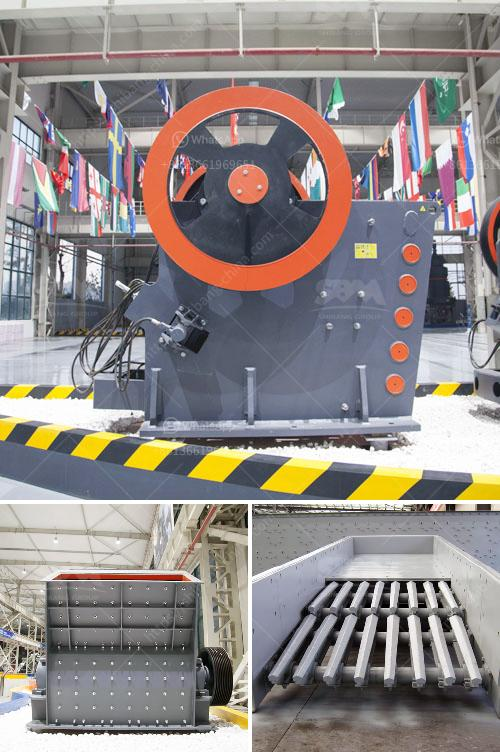

<h3>kaolin raymond mill price</h3>
Kaolin, a non-metallic mineral, is widely used in various industries, including papermaking, ceramics, rubber, paint, coatings, plastics, refractories, chemicals, pesticides, pharmaceuticals, textiles, oil and gas, and other fields. The market demand for kaolin is constantly increasing, which has led to the continuous development and improvement of kaolin milling equipment.

Raymond mill, as a non-metallic mineral milling equipment and a key equipment in the milling industry, has a very wide range of applications. After being processed by Raymond mill, kaolin can be used in ceramics, refractory materials, coatings, papermaking, fillers, pesticides, etc., with good performance and excellent quality. Raymond mills are well loved by customers for their stable performance, high cost performance, and energy saving and environmental protection.

As a mainstream equipment in the industry, the current market demand for Raymond mills is relatively large. However, due to the different manufacturers, their manufacturing costs, technology, and equipment quality are also different, which will lead to different Raymond mill prices in the market. Therefore, when purchasing equipment, users need to compare the prices and choose a suitable supplier.

The price of Raymond mill is affected by many factors, such as equipment model, manufacturer, region, market demand, etc. Different manufacturers have different pricing methods. Some manufacturers directly quote the ex-factory price, while others calculate the equipment price according to the customer's specific needs. Therefore, the price of Raymond mill is not fixed and needs to be specifically analyzed and compared. 

In general, the price of a 3R Raymond mill is between 22,000-30,000 USD, and the price of a 4R Raymond mill is between 30,000-50,000 USD. The specific price needs to be calculated according to the specific configuration of the customer. The detailed quotation for each manufacturer can be obtained through consultation.

When purchasing the equipment, users should not only focus on the price, but also pay attention to the manufacturer's strength, equipment quality, after-sales service, and other factors. A good manufacturer can provide users with comprehensive services, including pre-sales, sales, and after-sales services, and ensure the normal operation of the equipment.

In conclusion, as a grinding equipment for non-metallic minerals, Raymond mills have a wide range of applications and are favored by the market. When purchasing equipment, users should not only focus on the price, but also consider the manufacturer's strength, equipment quality, and after-sales service. By comparing and choosing a suitable supplier, users can obtain a high-quality Raymond mill at a reasonable price.
<h3>Contact us</h3><ul><li><strong>Whatsapp:&nbsp;<a href="https://wa.me/8613661969651">+8613661969651</a></strong></li><li><a href="https://swt.shibang-china.com/?git&amp;zhl&amp;kaolin raymond mill price"><strong>Online Service(chat now)</strong></a></li></ul><h3>Related</h3><ul><li><a href='mobile crushers south africa.md'>mobile crushers south africa</a></li><li><a href='ultrafine pulverizer.md'>ultrafine pulverizer</a></li><li><a href='china ultra fine grinders mill.md'>china ultra fine grinders mill</a></li><li><a href='crushers made in south philippines.md'>crushers made in south philippines</a></li><li><a href='clay crusher manufacturing process.md'>clay crusher manufacturing process</a></li></ul>