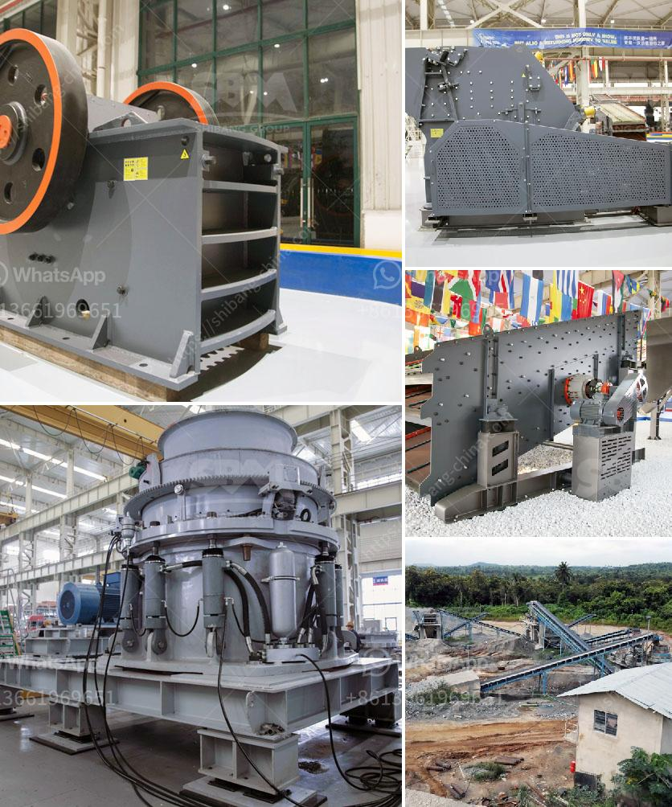

<h3>kenya stone crusher usa</h3>
Kenya is one of the countries with a stone crushing industry and it is located in the Eastern part of Africa. It has been proven that this country has significant untapped stone resources. Kenya is endowed with various types of stone deposits ranging from volcanic rocks, gravel, sandstones, coral stones, quartzite, and many others. The country has also seen various stone crushing companies set up crushing plants in different parts of the country.

The USA, on the other hand, has a well-developed stone crushing industry which provides employment opportunities to many people. In this industry, stone crushers generate huge amounts of raw materials, reducing large-sized rocks into smaller sizes for further use in construction work or other purposes.

The stone crushing industry in Kenya has been growing rapidly due to increasing demand from the construction sector and other industrial activities. Most mining companies in the region are excavating limestone, which is an important raw material for cement production. In addition to limestone, other stones such as granite, basalt, sandstone, and others are also mined in Kenya.

To meet the growing demand for crushed stones in Kenya, various crushers have been set up in different parts of the country. These stone crushing plants have different capabilities and the technology used varies from one crusher to another. Some of the crushers used in Kenya's stone crushing industry include jaw crushers, impact crushers, and cone crushers.

The crushers in Kenya are designed for both manual and mechanical operations. Most of the stone crushing units are focused on minimizing human intervention through the use of advanced technology. This ensures that the crushing process is efficient and reduces the health and safety risks associated with manual stone crushing.

The stone crushing industry in Kenya has contributed significantly to the country's economy by providing employment opportunities to thousands of people directly and indirectly. It has also contributed to the development of infrastructure projects such as roads, bridges, and buildings. The availability of crushed stones has also facilitated the growth of the construction sector, which plays a crucial role in the economic growth of the country.

In conclusion, Kenya's stone crushing industry has provided significant benefits to the country's economy. The industry has experienced steady growth due to increasing demand for crushed stones in various sectors. With the presence of advanced crushers and technology, the industry is expected to continue to thrive and contribute to the overall development of Kenya.
<h3>Contact us</h3><ul><li><strong>Whatsapp:&nbsp;<a href="https://wa.me/8613661969651">+8613661969651</a></strong></li><li><a href="https://swt.shibang-china.com/?git&amp;zhl&amp;kenya stone crusher usa"><strong>Online Service(chat now)</strong></a></li></ul><h3>Related</h3><ul><li><a href='jaw crusher for sale in auction.md'>jaw crusher for sale in auction</a></li><li><a href='hydro sizing silica sand crusher plant.md'>hydro sizing silica sand crusher plant</a></li><li><a href='coal wash plant indonesia.md'>coal wash plant indonesia</a></li><li><a href='rock crushers cost tons per hour.md'>rock crushers cost tons per hour</a></li><li><a href='small gold ore jaw crushers.md'>small gold ore jaw crushers</a></li></ul>