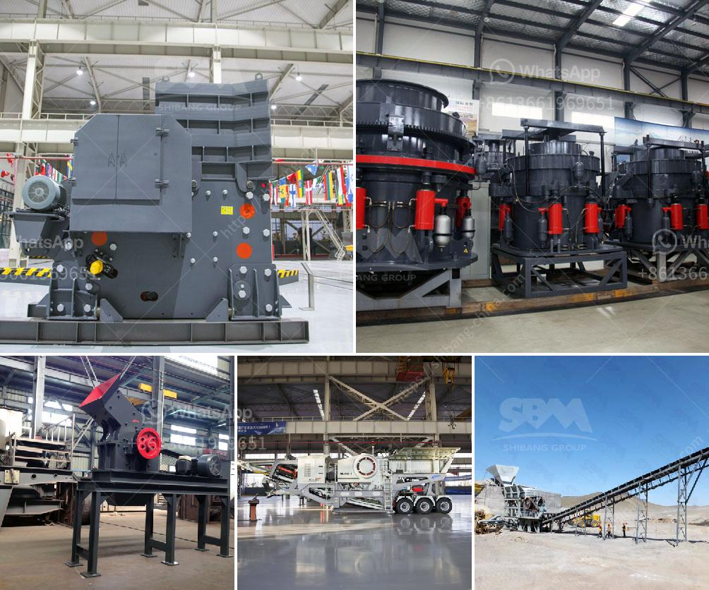

<h3>land available for stone quarry</h3>
Nature has provided us with a wealth of resources, and one such valuable resource is the vast abundance of stones found beneath the Earth's surface. In pursuit of these precious gems, stone quarries act as the gateway to tapping into this hidden wealth. With intriguing opportunities for various industries, the availability of land specifically designated for stone quarrying presents a compelling proposition. In this article, we will delve into the significance of such land, its advantages, and the potential it holds for economic growth and development.

Stone quarrying, a centuries-old industry, plays an essential role in society's development and infrastructure growth. From construction materials to decorative stonework, the demand for stones is ever-increasing. To support this demand, having dedicated land available for stone quarries provides businesses and stakeholders with a sustainable and reliable source of raw materials.

1. Accessibility and Convenience: Land specifically earmarked for stone quarrying ensures that the resources are easily accessible to quarry operators and other supply chain participants. Proximity to urban areas and transportation networks reduces logistical challenges, allowing for efficient extraction, processing, and distribution of stone resources.

2. Resource Planning and Conservation: Designated land for stone quarrying offers an opportunity to optimize resource planning. Careful geological assessments can be conducted, revealing the quality, quantity, and types of stones present. This knowledge facilitates sustainable extraction practices and ensures minimal environmental impact, leading to more efficient and responsible resource management.

3. Economic Prosperity: When stone quarries are established on dedicated land, they become a catalyst for economic growth. Job opportunities are created directly within the quarrying industry, attracting skilled labor and supporting the local workforce. Additionally, quarrying stimulates downstream industries, such as construction, architecture, and landscaping, further boosting the economy.

4. Preservation of Natural Landscapes: By concentrating the extraction and quarrying activities to dedicated land, the environmentally sensitive areas are protected from potential damage. With precise land allocation, regulatory bodies can ensure that quarries do not encroach on ecologically important regions, rivers, or forest reserves, thus preserving natural landscapes and biodiversity.

5. Safety and Regulation Compliance: Well-managed quarries on designated land uphold stringent safety measures and comply with environmental regulations. They operate within the framework of governmental and industry standards, ensuring the well-being of workers, reducing hazards, and minimizing pollution risks. This results in safer working conditions for employees and a more sustainable environmental footprint.

While the advantages are clear, it is essential to foster a sustainable approach within the stone quarrying industry. Ecological concerns must be addressed through better reclamation and restoration practices. Utilizing advanced technology and machinery can aid in minimizing the environmental footprint while maximizing production output.

Availability of land designated for stone quarrying is a valuable asset that presents numerous opportunities for economic growth, development, and responsible resource management. By optimizing accessibility, conserving resources, and adhering to regulatory guidelines, stone quarries can become thriving hubs that contribute to local economies while preserving the surrounding environment. Collaboration between stakeholders, governments, and industries is vital in ensuring efficient and sustainable quarrying practices for the long-term prosperity of all involved.
<h3>Contact us</h3><ul><li><strong>Whatsapp:&nbsp;<a href="https://wa.me/8613661969651">+8613661969651</a></strong></li><li><a href="https://swt.shibang-china.com/?git&amp;zhl&amp;land available for stone quarry"><strong>Online Service(chat now)</strong></a></li></ul><h3>Related</h3><ul><li><a href='mobile cone crusher for sale.md'>mobile cone crusher for sale</a></li><li><a href='ethiopia crusher jaw crusher.md'>ethiopia crusher jaw crusher</a></li><li><a href='coal crusher machine capacity of 5 tons an hour.md'>coal crusher machine capacity of 5 tons an hour</a></li><li><a href='used crusher for sale sell buy.md'>used crusher for sale sell buy</a></li><li><a href='vertical mill for calcite.md'>vertical mill for calcite</a></li></ul>