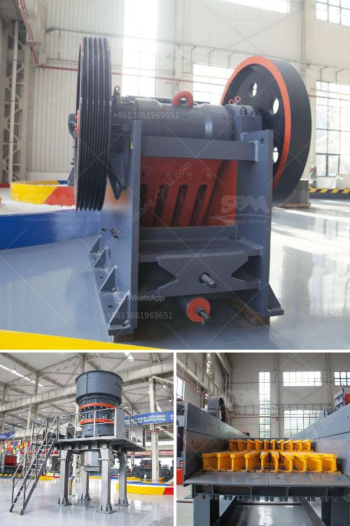

<h3>large capacity jaw crusher machines sales to india</h3>
India is one of the fastest-growing construction markets in the world. With rapid urbanization and increasing population, the demand for infrastructure development is on the rise. This has led to a significant increase in the construction industry, requiring high-quality equipment to meet the growing demands. In particular, large capacity jaw crusher machines are in high demand as they can handle a wide variety of materials and have a large feed opening, allowing them to handle large-sized rocks efficiently.

Jaw crushers are primarily used in the mining industry as a primary crusher, reducing the ore size to manageable sizes for the next stage in the process. They are robust machines capable of handling even the toughest materials, such as granite, basalt, and iron ore. With its simple structure and reliable performance, the jaw crusher is a popular choice among contractors and quarry operators.

One of the leading manufacturers in the global jaw crusher market is India-based Shree Conmix Engineers Pvt. Ltd. For over three decades, the company has been manufacturing high-quality aggregate crushing equipment for customers worldwide. They offer a wide range of jaw crushers, from small and portable units to large industrial machines with a capacity of up to 700 tons per hour.

Shree Conmix Engineers Pvt. Ltd. jaw crushers are known for their excellent reliability and durability. Their machines are designed to withstand heavy-duty applications and provide consistent performance even in the toughest conditions. The company uses advanced manufacturing techniques and high-quality materials to ensure their products meet the highest standards.

The large capacity jaw crusher machines offered by Shree Conmix Engineers Pvt. Ltd. are designed to handle even the toughest materials. With a feed opening of up to 1200 x 1300mm, these machines can handle large-sized rocks with ease. The powerful hydraulic system ensures smooth and efficient operation, while the adjustable wedge setting allows for precise control over the final product size.

With the increasing demand for infrastructure development in India, the sales of large capacity jaw crusher machines are set to soar. These machines are essential for the construction of roads, bridges, and buildings, as well as the extraction of valuable minerals from the earth. The robust design and high performance of Shree Conmix Engineers Pvt. Ltd. jaw crushers make them the ideal choice for customers looking for reliable and efficient crushing equipment.

Furthermore, Shree Conmix Engineers Pvt. Ltd. offers excellent after-sales service and technical support, ensuring customers get the most out of their machines. They have a dedicated team of engineers and technicians who provide prompt assistance and maintenance services to keep the jaw crushers running smoothly. This commitment to customer satisfaction has made them a trusted name in the crushing equipment market.

In conclusion, the large capacity jaw crusher machines offered by Shree Conmix Engineers Pvt. Ltd. are an excellent choice for customers in India. With their robust construction, high reliability, and excellent performance, these machines are capable of handling even the toughest materials. The company's commitment to customer satisfaction and after-sales support further adds value to their products. As India's construction industry continues to grow, the demand for high-quality equipment like jaw crushers will continue to rise, making Shree Conmix Engineers Pvt. Ltd. a reliable partner for customers in India.
<h3>Contact us</h3><ul><li><strong>Whatsapp:&nbsp;<a href="https://wa.me/8613661969651">+8613661969651</a></strong></li><li><a href="https://swt.shibang-china.com/?git&amp;zhl&amp;large capacity jaw crusher machines sales to india"><strong>Online Service(chat now)</strong></a></li></ul><h3>Related</h3><ul><li><a href='crusher manufacturer in pakistan.md'>crusher manufacturer in pakistan</a></li><li><a href='german crusher for sale.md'>german crusher for sale</a></li><li><a href='iron crushing equipment cost.md'>iron crushing equipment cost</a></li><li><a href='hydraulic system vertical roller mill.md'>hydraulic system vertical roller mill</a></li><li><a href='cement plant machine.md'>cement plant machine</a></li></ul>