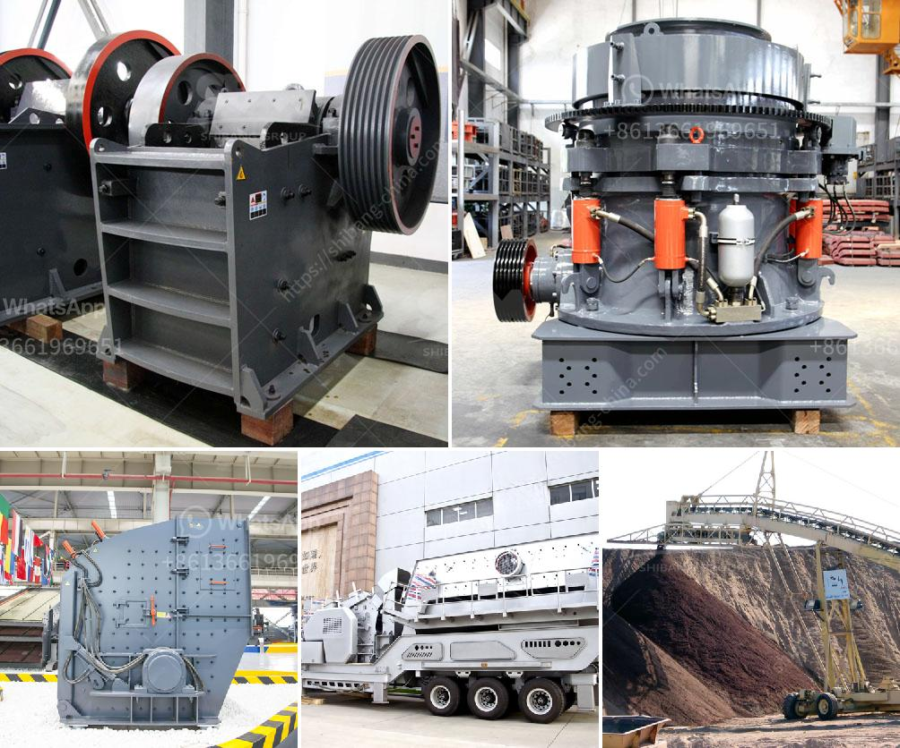

<h3>large scale basalt rock crusher</h3>
Basalt is a distinctive and durable volcanic rock that forms naturally from volcanic lava. Although basalt is usually black in color, it often contains crystals and minerals, making it one of the most beautiful rock materials. Due to its excellent hardness and heat resistance, basalt is widely used in construction, road building, and industrial applications. A large scale basalt rock crusher is an essential tool for mining and construction.

Basalt crusher machinery plays an important role in the basalt stone crushing plant. There are generally three types of primary crushers: jaw crusher, impact crusher, and cone crusher. Jaw crushers are used for the primary crushing of large chunks of basalt, while impact crushers or cone crushers are used for the secondary crushing to achieve a uniform particle size. Impact crushers produce more cubic-shaped end products, while cone crushers are known for producing high-quality aggregates.

A large scale basalt rock crusher can also be configured with a vibrating screen to grade the crushed materials into different specifications. The crushed stone that meets the required final particle size is discharged from the lower part of the crusher, while the unqualified stone is returned to the crusher for re-crushing. This closed-loop system ensures that the final product meets the desired size and quality.

One of the key advantages of a large scale basalt rock crusher is its production capacity. With a high-quality machine, it can process large amounts of basalt rocks in a relatively short time, greatly increasing production efficiency. This is particularly important for mining and construction companies that require a steady supply of aggregate materials for their projects. Additionally, the durable nature of basalt ensures that the rock crusher can withstand heavy use for extended periods without experiencing significant wear and tear.

Furthermore, large scale basalt rock crushers are generally equipped with advanced technology, allowing for efficient and precise operation. For instance, some crushers have automatic control systems that monitor and adjust the machine in real-time based on the specific parameters and needs of the crushing process. This results in improved performance and reduced downtime due to manual adjustments.

In conclusion, a large scale basalt rock crusher is an essential tool for mining and construction. With its high production capacity, durability, and efficient operation, it can process large amounts of basalt rocks into high-quality aggregates that are suitable for various applications. Whether it is used in road construction, building construction, or industrial projects, a reliable basalt rock crusher ensures that the required materials are readily available, contributing to the overall success of the project.
<h3>Contact us</h3><ul><li><strong>Whatsapp:&nbsp;<a href="https://wa.me/8613661969651">+8613661969651</a></strong></li><li><a href="https://swt.shibang-china.com/?git&amp;zhl&amp;large scale basalt rock crusher"><strong>Online Service(chat now)</strong></a></li></ul><h3>Related</h3><ul><li><a href='roller mill for sale kenya.md'>roller mill for sale kenya</a></li><li><a href='price of roller mill machine.md'>price of roller mill machine</a></li><li><a href='basalt processing line.md'>basalt processing line</a></li><li><a href='small rock crusher for sale.md'>small rock crusher for sale</a></li><li><a href='crusher conveyor belt.md'>crusher conveyor belt</a></li></ul>