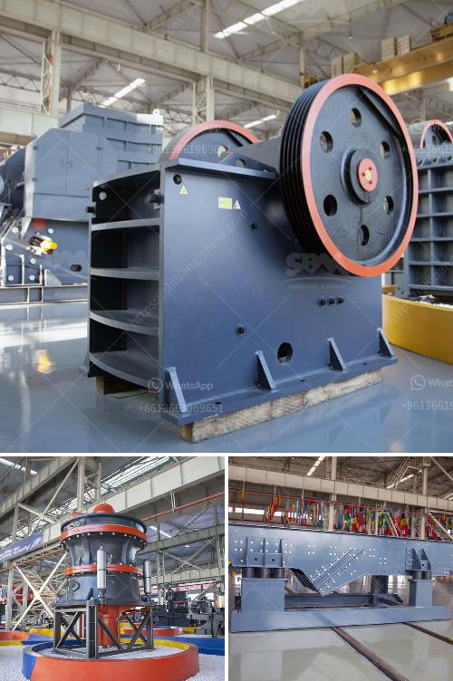

<h3>latest aggregate and sand prices in uae</h3>
The construction industry in the United Arab Emirates (UAE) is one of the most prominent sectors driving the country's economic growth. The constant demand for infrastructure development and urbanization fuels the need for aggregates and sand, which are essential components in construction projects. However, this sector has seen fluctuations in prices due to various factors such as supply and demand dynamics, regulations, and economic conditions.

The price of aggregates, including crushed stone, gravel, and sand, has been fluctuating in the UAE in recent years. These materials are crucial in the construction of buildings, roads, bridges, and other infrastructure projects. The latest aggregate and sand prices in the UAE show a slight increase compared to previous years. A ton of aggregate typically ranges from AED 70 to AED 90, while a ton of high-quality sand can cost anywhere between AED 100 to AED 130.

Several factors contribute to the variation in prices. One of the main drivers is supply and demand dynamics. The growing population and continuous urbanization in the UAE result in a high demand for construction materials, including aggregates and sand. This increased demand can lead to higher prices as suppliers strive to meet the market requirements.

Government regulations also play a significant role in impacting prices. In an effort to promote sustainable development and protect the environment, the UAE government has implemented strict regulations regarding the extraction of aggregates and sand. These regulations aim to prevent excessive exploitation of natural resources and ensure their proper management. As a result, suppliers need to invest in sustainable extraction methods, which can lead to higher production costs and ultimately affect prices.

Furthermore, economic conditions both locally and globally influence the cost of aggregates and sand. In recent years, the UAE has faced some economic challenges, mainly due to the impact of the COVID-19 pandemic and declining oil prices. Such factors can affect construction activities and reduce the demand for construction materials. Consequently, suppliers might lower their prices to attract customers and maintain their market share.

Despite the fluctuations, the UAE government has taken strategic steps to stabilize prices and ensure the sustainability of the construction sector. Initiatives such as the development of local quarries and the promotion of recycled aggregates and sand can contribute to a more stable pricing structure. These measures not only reduce dependence on imported materials but also support the circular economy by minimizing waste and preserving natural resources.

In conclusion, the latest aggregate and sand prices in the UAE have seen some fluctuations in recent years. Increased demand, government regulations, and economic conditions all contribute to these variations. However, the UAE government's efforts to promote sustainable practices and develop local resources are steps in the right direction. As the construction industry continues to grow, maintaining stable prices and ensuring the availability of high-quality aggregates and sand will be crucial for sustainable development in the UAE.
<h3>Contact us</h3><ul><li><strong>Whatsapp:&nbsp;<a href="https://wa.me/8613661969651">+8613661969651</a></strong></li><li><a href="https://swt.shibang-china.com/?git&amp;zhl&amp;latest aggregate and sand prices in uae"><strong>Online Service(chat now)</strong></a></li></ul><h3>Related</h3><ul><li><a href='cornerstone equipment inc used rock crushers.md'>cornerstone equipment inc used rock crushers</a></li><li><a href='used hammer crusher.md'>used hammer crusher</a></li><li><a href='quarry machine in kenya.md'>quarry machine in kenya</a></li><li><a href='apron in cement plant crusher.md'>apron in cement plant crusher</a></li><li><a href='hammer crusher german made.md'>hammer crusher german made</a></li></ul>