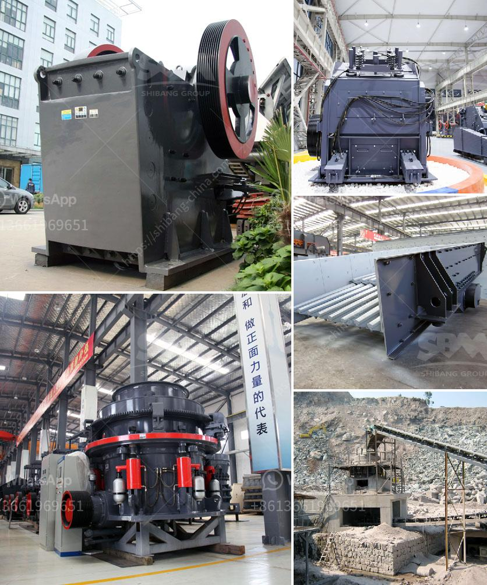

<h3>latest stone crusher machine price india</h3>
The price of stone crusher machines in India has been rising steadily due to increasing demand from the construction industry and infrastructure projects. The recent increase in the tariffs on various stone crusher machines in India has resulted in a surge in market prices as these crushers are popularly used for mining purposes. The latest stone crusher machine price in India is not only affected by the scale of production, but also by the influence of various issues.

With the economic development in India and the construction of various infrastructures in India, the demand for stone crushers has increased significantly. Market competition is growing, which forces manufacturers to constantly adjust their product prices. Many users are concerned about the issue of high-quality stone crushers. Currently, the price of stone crushers produced by manufacturers in India is becoming more and more expensive, which makes users reluctant to buy.

In order to solve the above problems, we have conducted a detailed analysis and research on the stone crusher machine price in India market. The following is the analysis of the factors affecting the price of stone crusher machines.

Firstly, the brand and manufacturing technology of stone crushers. Some manufacturers are just middlemen who collect profits and bear no responsibility for quality control. This leads to a large price difference in the market. However, reputable manufacturers have strict production regulations and advanced manufacturing technology, which ensures the high quality of their products. The price of such stone crushers may be slightly higher, but the overall performance is excellent.

Secondly, the production capacity of the stone crusher machine. Different types of stone crushers have different production capacities. For example, the capacity of jaw crushers can range from a few tons to hundreds of tons per hour. Cone crushers can process more materials and produce fine-grained products, but the processing capacity is low. The price of stone crushers with different output capacities is different, ranging from tens of thousands to hundreds of thousands.

Thirdly, the models of stone crushers. Choosing different models of stone crushers will directly affect the investment cost and price of the machines. Generally, the price of large-scale stone crushers will be higher than that of small-scale ones because the production cost of large-scale equipment is higher and the profits are higher.

Lastly, the input cost of the stone crusher machine. Compared to the manpower and material resources invested in the early stage of the project, the input cost of purchasing stone crushers should be relatively low. The machine should be durable and easy to maintain.

In summary, the price of stone crusher machines in India is unpredictable and fluctuates based on factors such as production capacity, brand, and models, among others. We can conclude that stone crusher machines are expensive and have a high market price. Based on this, we can make the following recommendations:

1. Choose reputable manufacturers: Although the price of products from reputable manufacturers may be higher, it ensures the excellent performance and good after-sales service.

2. Determine the production capacity: According to the specific requirements of the project, choose stone crushers with appropriate production capacities to avoid over-investment.

3. Consider the cost-effectiveness: It is important to consider the overall performance-price ratio when purchasing stone crushers. A balance should be maintained between the input cost and the quality of the machines.

By carefully considering these factors, potential buyers can make informed decisions and choose the most suitable stone crusher machines with the best value for money.
<h3>Contact us</h3><ul><li><strong>Whatsapp:&nbsp;<a href="https://wa.me/8613661969651">+8613661969651</a></strong></li><li><a href="https://swt.shibang-china.com/?git&amp;zhl&amp;latest stone crusher machine price india"><strong>Online Service(chat now)</strong></a></li></ul><h3>Related</h3><ul><li><a href='how much crusher cost.md'>how much crusher cost</a></li><li><a href='coal pulverizer machine hammer.md'>coal pulverizer machine hammer</a></li><li><a href='ball mill in mining.md'>ball mill in mining</a></li><li><a href='cement plant machine.md'>cement plant machine</a></li><li><a href='portable cone crusher specification.md'>portable cone crusher specification</a></li></ul>