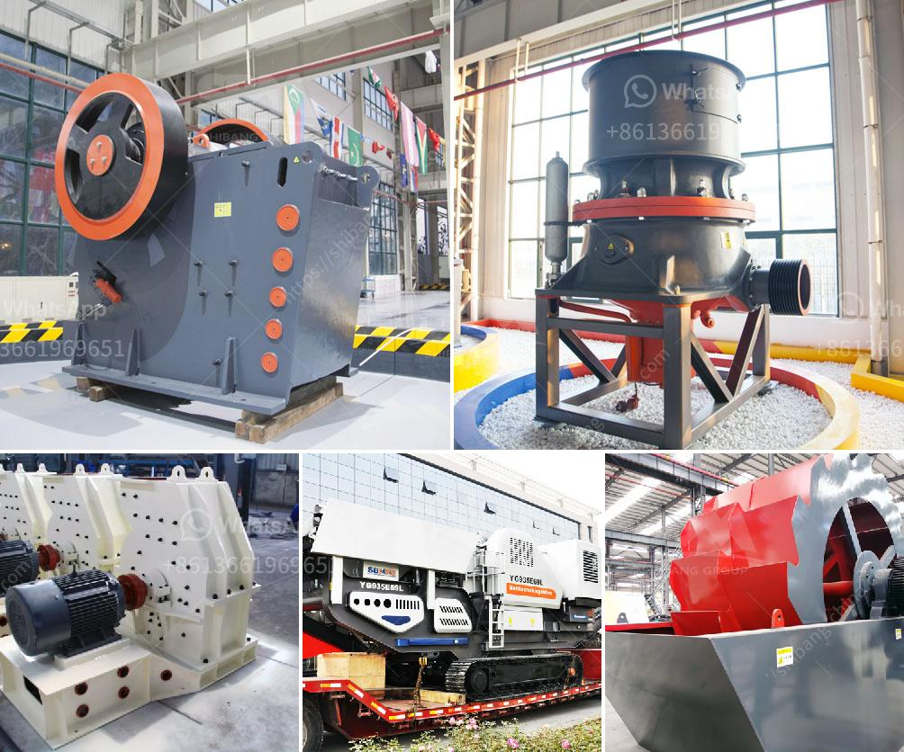

<h3>lime stone grinder mill</h3>
Limestone has long been used as a material for constructing buildings, roads, and other structures. It is abundant and readily available, making it a popular choice for various applications. However, before limestone can be used effectively, it needs to be processed into a fine powder. This is where limestone grinder mills come into play.

A limestone grinder mill is a grinding machine specifically designed to grind limestone into fine powder. It is capable of processing hundreds of minerals into different particle sizes. With the use of limestone grinder mills, the desired limestone powder can be produced accurately and efficiently.

One of the main advantages of using a limestone grinder mill is its ability to produce a consistent particle size. This is important for many industries that require specific particle sizes for their products. For example, the construction industry often requires limestone powder in precise sizes to create different types of building materials, such as cement and concrete. By using a limestone grinder mill, the desired particle size can be easily achieved, resulting in high-quality end products.

Limestone grinder mills are also known for their durability and reliability. They are built to withstand heavy-duty use and can grind limestone continuously without any issues. This ensures that businesses can rely on their limestone grinder mills for consistent performance and productivity.

Furthermore, limestone grinder mills are designed with advanced technology that allows for easy operation and maintenance. They have user-friendly controls and are equipped with safety features to ensure the safety of operators. Additionally, many limestone grinder mills are energy-efficient, reducing energy consumption and operating costs.

In conclusion, limestone grinder mills are essential equipment for processing limestone into fine powder. Their ability to produce consistent particle sizes, durability, and reliability make them a valuable asset for various industries. Whether it is for construction, agriculture, or manufacturing, limestone grinder mills offer a cost-effective and efficient solution for grinding limestone.
<h3>Contact us</h3><ul><li><strong>Whatsapp:&nbsp;<a href="https://wa.me/8613661969651">+8613661969651</a></strong></li><li><a href="https://swt.shibang-china.com/?git&amp;zhl&amp;lime stone grinder mill"><strong>Online Service(chat now)</strong></a></li></ul><h3>Related</h3><ul><li><a href='vibratory ball mill china.md'>vibratory ball mill china</a></li><li><a href='graphite processing equipment.md'>graphite processing equipment</a></li><li><a href='crusher equipment price.md'>crusher equipment price</a></li><li><a href='limestone crushing machine supplier.md'>limestone crushing machine supplier</a></li><li><a href='vibratory feeder manufacturer china.md'>vibratory feeder manufacturer china</a></li></ul>