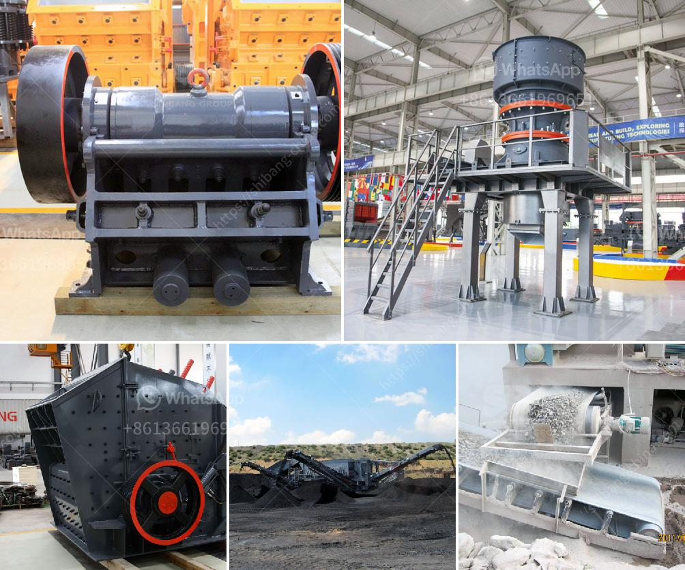

<h3>limestone ball mill in egypt</h3>
Limestone is a sedimentary rock, formed by the deposition of marine organisms such as coral, shells, and mollusks. It is a common building material and a popular choice for flooring and wall cladding in Egypt. Limestone is also used in cement production, as an aggregate in concrete, and as a raw material for various industrial applications.

To process limestone into powder, a limestone ball mill is used. The ball mill is a key piece of equipment for grinding crushed materials, and it is widely used in production lines for powders such as cement, silicates, refractory material, fertilizer, glass ceramics, etc. As well as for ore dressing of both ferrous and non-ferrous metals.

In Egypt, the limestone ball mill is widely used in powder-making production line including cement, silicate, new-type building material, refractory material, fertilizer, ore dressing of ferrous metal and non-ferrous metal, glass ceramics, etc. And the ball mill can grind various ores and other materials with dry type and wet type. There are two kinds of ball mill, grate type and overfall type due to different ways of discharging material.

The limestone ball mill in Egypt is expected to grow from USD XX.0 million in 2018 to USD XX.0 million by 2025, at a Compound Annual Growth Rate (CAGR) of 4.0% during the forecast period. The research provides insights for the global Limestone Ball Mill market based on different Types, End-Users and Regions, and competitive landscape of these segments are analyzed in detail.

A significant factor driving the growth of the limestone ball mill market is the growing construction industry in Egypt. With rising urbanization and infrastructure development, there is an increasing demand for cement, which is the major application of limestone. The limestone ball mill plays a vital role in the cement manufacturing process as it is used to grind limestone into powder that is used as cement additive. With the increasing amounts of cement used in construction projects, there is a high demand for limestone in Egypt.

Another key factor contributing to the growth of the limestone ball mill market is the increasing use of renewable energy sources such as wind and solar power in Egypt. Limestone is used as a fluxing agent in the manufacturing of iron and steel, and it is also used in the manufacturing of glass, pulp & paper, chemicals, and pharmaceuticals. With the growing focus on sustainable energy sources, the demand for limestone is expected to rise in these industries.

Moreover, Egypt has a rich history and cultural heritage, with numerous historical sites made of limestone. The restoration and preservation of these historical sites also contribute to the demand for limestone.

In conclusion, the limestone ball mill in Egypt is a significant player in the market, offering great benefits to various industries. Its diverse applications and growing demand make it a profitable market for businesses. As Egypt continues to invest in infrastructure development and sustainable energy sources, the demand for limestone is expected to rise, further driving the growth of the limestone ball mill market.
<h3>Contact us</h3><ul><li><strong>Whatsapp:&nbsp;<a href="https://wa.me/8613661969651">+8613661969651</a></strong></li><li><a href="https://swt.shibang-china.com/?git&amp;zhl&amp;limestone ball mill in egypt"><strong>Online Service(chat now)</strong></a></li></ul><h3>Related</h3><ul><li><a href='crusher machine price.md'>crusher machine price</a></li><li><a href='gold processing ball mills in india china.md'>gold processing ball mills in india china</a></li><li><a href='cement plant feasibility report.md'>cement plant feasibility report</a></li><li><a href='coal mill hydraulic system principles.md'>coal mill hydraulic system principles</a></li><li><a href='hydraulic system vertical roller mill.md'>hydraulic system vertical roller mill</a></li></ul>