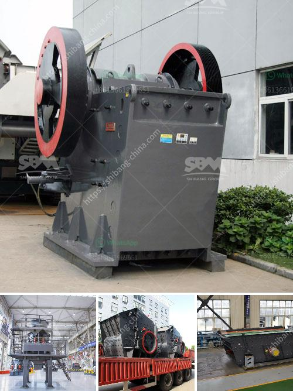

<h3>limestone coal grinding machinery manufacture in india</h3>
India is the world's second largest producer of limestone, a key ingredient in cement manufacturing. Limestone accounts for about 22% of the country's total cement production. As the demand for cement continues to grow rapidly, even the existing manufacturing facilities are not able to meet the requirements. To cater to this need, Indian manufacturers are now developing advanced limestone coal grinding machinery that offers ease of operation, low maintenance, and user-friendly features.

India's leading manufacturers of limestone coal grinding machinery are continuously focusing on technological upgradation to cater to the increasing demand for quality cement. They are investing significantly in research and development to improve the efficiency of grinding mills and reduce their environmental impact. These manufacturers are also incorporating state-of-the-art automation technologies to ensure precision and consistency in the grinding process.

One of the key advantages of using limestone coal grinding machinery is its ability to produce a consistent particle size distribution. This ensures that the cement produced using limestone coal grinding machinery has a uniform quality, enhancing its strength and durability. Additionally, this machinery is designed to operate at high capacities, allowing manufacturers to meet the growing demand effectively.

India's limestone coal grinding machinery manufacturers are also collaborating with global technology and research organizations to develop advanced grinding technologies that will significantly improve the grinding process and reduce energy consumption. These initiatives are expected to contribute significantly to the sustainability of the cement manufacturing industry in India.

Furthermore, the availability of cost-effective limestone coal grinding machinery in India is attracting foreign investments and promoting the country's position as a global manufacturing hub. International companies are partnering with Indian manufacturers to set up state-of-the-art grinding units in India to meet the increasing demand for cement in both the domestic and international markets.

In conclusion, the development of limestone coal grinding machinery in India is spearheading the country's cement manufacturing industry's growth. The availability of advanced grinding technologies, ease of operation, and low maintenance requirements are attracting both domestic and international manufacturers to choose India as their preferred manufacturing destination. This growth is expected to contribute significantly to the country's economic development and infrastructure improvement.
<h3>Contact us</h3><ul><li><strong>Whatsapp:&nbsp;<a href="https://wa.me/8613661969651">+8613661969651</a></strong></li><li><a href="https://swt.shibang-china.com/?git&amp;zhl&amp;limestone coal grinding machinery manufacture in india"><strong>Online Service(chat now)</strong></a></li></ul><h3>Related</h3><ul><li><a href='stone crusher supplier in orissa.md'>stone crusher supplier in orissa</a></li><li><a href='crushing milling machine for graphite powder.md'>crushing milling machine for graphite powder</a></li><li><a href='jaw crusher part diagram.md'>jaw crusher part diagram</a></li><li><a href='company mobile crushers.md'>company mobile crushers</a></li><li><a href='total cost of stone crushing unit in india.md'>total cost of stone crushing unit in india</a></li></ul>