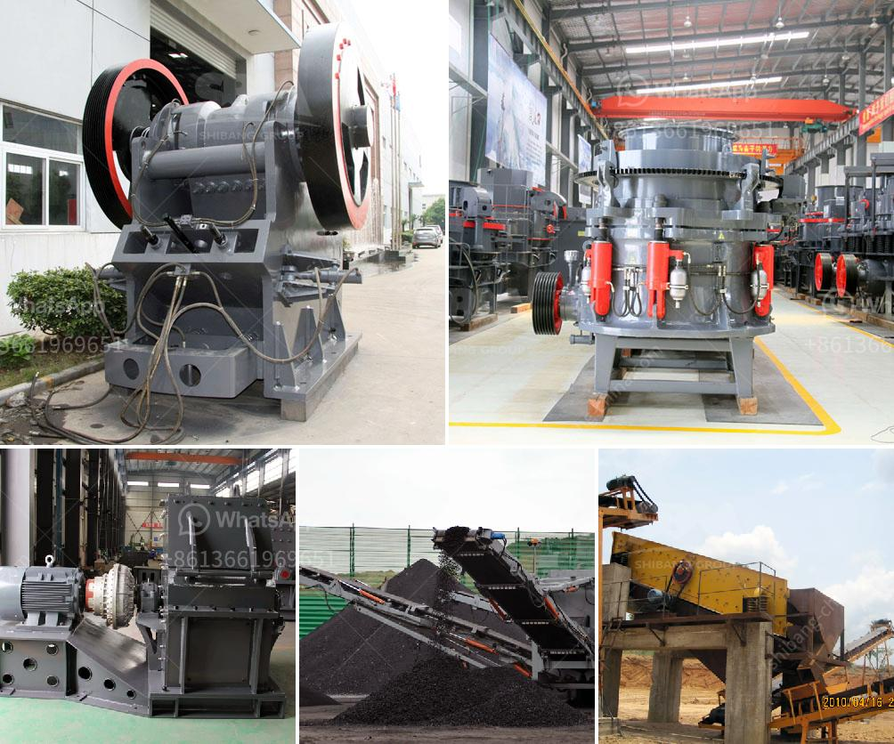

<h3>limestone crusher hammers</h3>
Limestone is a sedimentary rock that is widely used in construction, agriculture, and industry. It is one of the most commonly used materials in the world, helping to create buildings, roads, and even the food we eat. Limestone is a versatile and durable material that can be crushed into different sizes and used in a variety of applications.

To crush limestone, one of the main equipment need is a crusher. With the continuous growth of the construction industry, the demand for limestone has been increasing. Therefore, more and more limestone crushing projects are being carried out all over the world. Limestone crusher hammers are the most commonly used spare parts for crushing limestone.

The limestone crusher hammers are heavy-duty attachments suitable for crushing hard and abrasive materials. They are widely used in the mining, quarrying, smelting, cement, and recycling industries. Limestone crusher hammers are made of high manganese steel, which provides maximum wear resistance. These hammers are also designed with tungsten carbide pins to minimize wear and tear.

1. High Crushing Efficiency: Limestone crusher hammers have a unique design that allows them to crush efficiently. The hammers are able to rotate freely, ensuring a uniform crushing process and reducing the risk of uneven wearing.

2. Long Lifespan: Limestone crusher hammers are made of high-quality materials, which ensures their durability and strength. They can withstand heavy use without requiring frequent replacements, saving time and money.

3. Versatility: Limestone crusher hammers can be used in a variety of applications. They are suitable for crushing different types of limestone, including hard limestone and soft limestone. Whether it is for a construction project or a cement plant, these hammers can handle the job.

4. Easy Maintenance: Limestone crusher hammers are easy to maintain. Regular inspection and maintenance can help identify any potential issues and prevent major breakdowns. Additionally, the hammers can be easily replaced when necessary.

1. Material: Ensure that the hammers are made of high-quality materials, such as high manganese steel or tungsten carbide. These materials offer excellent wear resistance and durability.

2. Size: Choose the appropriate size of hammers based on the application and the size of the limestone being crushed. Larger hammers are suitable for crushing larger pieces of limestone, while smaller hammers are better for finer crushing.

3. Compatibility: Ensure that the hammers are compatible with the crusher. Different crushers have different specifications for hammers, so it is important to choose the right ones for your equipment.

4. Supplier Reputation: Choose a reputable supplier that offers high-quality limestone crusher hammers. Look for suppliers with a good track record and positive customer reviews.

In conclusion, limestone crusher hammers are a crucial part of limestone crushing projects. They offer high crushing efficiency, durability, and versatility. When choosing hammers, it is important to prioritize quality and compatibility. With the right hammers, limestone can be effectively crushed, leading to the creation of various important products and structures.
<h3>Contact us</h3><ul><li><strong>Whatsapp:&nbsp;<a href="https://wa.me/8613661969651">+8613661969651</a></strong></li><li><a href="https://swt.shibang-china.com/?git&amp;zhl&amp;limestone crusher hammers"><strong>Online Service(chat now)</strong></a></li></ul><h3>Related</h3><ul><li><a href='artificial sand making.md'>artificial sand making</a></li><li><a href='aggregate crusher production.md'>aggregate crusher production</a></li><li><a href='cement plant machinery manufacturers.md'>cement plant machinery manufacturers</a></li><li><a href='crusher manufacturer in pakistan.md'>crusher manufacturer in pakistan</a></li><li><a href='copper processing equipment.md'>copper processing equipment</a></li></ul>