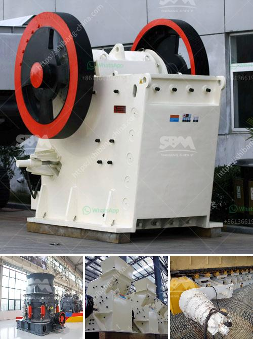

<h3>limestone crushers for sale</h3>
Limestone is a sedimentary rock composed mainly of calcium carbonate (CaCO3), usually in the form of calcite or aragonite. It is an essential component of many rocks such as marl, chalk, and travertine. Limestone has numerous uses: as a building material, an essential ingredient in the manufacture of cement, and a crucial component in steel production.

To obtain limestone, large blocks of the rock are mined from quarries and processed into various sizes using crushing equipment. The larger pieces of limestone are then fed into limestone crushers which employ hammers or jaws to break it down into manageable sizes.

While the use of limestone crushers is critical in cement plants, the process also creates a large amount of dust. However, the dust generated during limestone crushing can be mitigated by employing water spray systems or dust collectors. These devices work alongside the crusher to capture and suppress airborne particles before they can escape into the atmosphere.

1. Jaw Crushers: These are often employed as the primary crusher as they can handle large rocks and produce a consistent particle size. Jaw crushers are particularly suitable for challenging applications such as limestone, but can also be used in recycling operations.

2. Impact Crushers: These crushers utilize impact forces to crush the feed material, resulting in a high reduction ratio and excellent product shape. Impact crushers are versatile machines that can be used in various applications, including limestone processing.

3. Cone Crushers: Cone crushers are used mainly in the secondary and tertiary crushing stages. They are often used in conjunction with jaw crushers to produce the final crushed product. Cone crushers offer high crushing efficiency and can be used for both soft and hard materials.

When considering purchasing limestone crushers for sale, it's important to ensure that the equipment is of high quality and well-maintained. A reliable and robust crusher will offer long-term performance without frequent breakdowns, reducing downtime and optimizing productivity.

In addition, factors such as crusher capacity, feeding size, and desired output size should be considered to ensure that the selected crusher meets the specific requirements of the application. It's advisable to consult with experts or manufacturers to determine the most suitable equipment for the job.

Furthermore, after-sales service and support are vital considerations when purchasing limestone crushers. A reputable supplier will offer technical support, spare parts availability, and timely maintenance services to ensure smooth operation and maximum longevity of the equipment.

In conclusion, limestone crushers are essential equipment in limestone processing plants, providing the necessary particle size reduction for various applications. The selection of the appropriate crusher should be based on factors such as required capacity, feeding size, and desired output size. Ensuring a high-quality, well-maintained crusher with adequate after-sales support will maximize productivity and minimize downtime.
<h3>Contact us</h3><ul><li><strong>Whatsapp:&nbsp;<a href="https://wa.me/8613661969651">+8613661969651</a></strong></li><li><a href="https://swt.shibang-china.com/?git&amp;zhl&amp;limestone crushers for sale"><strong>Online Service(chat now)</strong></a></li></ul><h3>Related</h3><ul><li><a href='super fine grinding machine price in india.md'>super fine grinding machine price in india</a></li><li><a href='coal mining plant in ethiopia.md'>coal mining plant in ethiopia</a></li><li><a href='jaw crushers for sale in zimbabwe.md'>jaw crushers for sale in zimbabwe</a></li><li><a href='pine cone coal manufacturing machinery.md'>pine cone coal manufacturing machinery</a></li><li><a href='mobile tracked crushers.md'>mobile tracked crushers</a></li></ul>