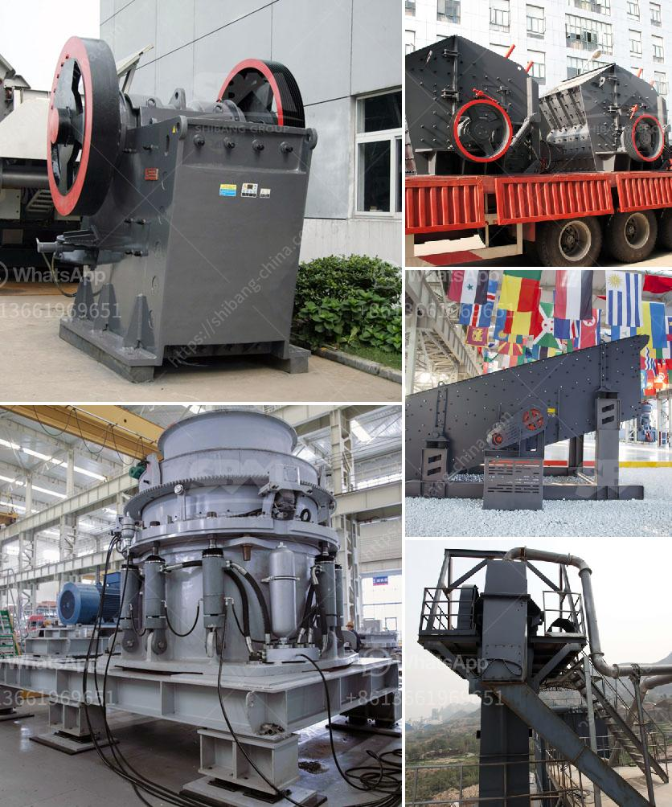

<h3>limestone crushing equipment</h3>
Limestone is a sedimentary rock composed mostly of the mineral calcite and comprising about 15% of the Earth's sedimentary crust. It is a basic building block of the construction industry (dimension stone) and a chief material from which aggregate, cement, lime, and building stone are made. 71% of all crushed stone produced in the U.S. is either limestone or dolomite. 

As a source for lime, it is used to make paper, plastics, glass, paint, steel, cement, carpets, used in water treatment and purification plants and in the processing of various foods and household items. Limestone is also a valuable resource for construction materials, agricultural neutralizers, and fertilizers.

One of the most common uses of limestone is making concrete, which is hardened by the addition of sand or gravel. This crushed stone is used for road construction, railroad ballast, filter stone, and cement. Limestone chips are used in numerous applications to help tackle industry challenges.

The limestone crushers and mills are effective for direct-injection of dry sorbent lime or limestone during the CFB process. Below you can explore our catalog of products that can complete a variety of limestone crushing applications. Direct Fired Roller Mill Pulverizers

Williams Direct Injection Roller Mills are used as limestone grinding machines and can grind to very exact particle sizes that are required for efficient SO2 removal. These limestone mills are designed to operate at 3 to 4 PSI (0.2 to 0.3 bar) and 250°F (120°C) to inject the limestone directly into the Circulating Fluidized Bed (CFB), thus eliminating costly material handling, storage, and drying equipment.

Williams Primary and Secondary Impact Crushers, Impactors, and Nuggetizer® Crusher are designed for a wide range of applications such as limestone, sand, gravel, asphalt, cement rock, and many types of minerals. Nuggetizer® Crushers are also well suited for steel and aluminum scrap.

Impact-style crushers include VSIs, as well as horizontal shaft impactors (HSIs), and are best used with less abrasive rock types, like limestone. These types of machines break apart material by the impacting forces of certain wear parts known as blow bars and impact plates or toggles.

Sometimes this design is referred to as a "New Holland style crusher." They are often used in mining operations, as the primary crushing unit.

Designed especially for the hardest material types, cone crushers are one of the best choices for crushing river gravel, basalt, and granite, along with abrasive materials in the mining industry like iron, chrome, magnesite, and copper ores.

The robust design and high-grade cast steel body of our cone crushers provide the strength and stability necessary for crushing extra-hard materials while ensuring low maintenance costs. Cone crushers are widely used in mining, metallurgy, building materials, highways, railways, water conservancy, chemical, and other industries.

Jaw crushers are an excellent primary crusher when used to prepare rock for subsequent processing stages. Cone and gyratory crushers are often used for initial reduction, followed by impact/vsi crushers, and finishes with stationary/skid-mounted screens. 

To summarize, the limestone crushing process involves breaking down the limestone ore to a specific size and then crushing it using a crusher and a limestone grinding machine. The resulting products are then used in a variety of applications, such as construction, agriculture, and various industries. The crushing equipment used is selected to ensure maximum production, efficiency, and utilization of limestone resources while minimizing environmental impact.
<h3>Contact us</h3><ul><li><strong>Whatsapp:&nbsp;<a href="https://wa.me/8613661969651">+8613661969651</a></strong></li><li><a href="https://swt.shibang-china.com/?git&amp;zhl&amp;limestone crushing equipment"><strong>Online Service(chat now)</strong></a></li></ul><h3>Related</h3><ul><li><a href='small scale gold milling and processing plant.md'>small scale gold milling and processing plant</a></li><li><a href='ultra fine powder grinding machine.md'>ultra fine powder grinding machine</a></li><li><a href='grinding of limestone for cement production.md'>grinding of limestone for cement production</a></li><li><a href='price of industrial ball mills.md'>price of industrial ball mills</a></li><li><a href='rock crusher distributors in denver colorado.md'>rock crusher distributors in denver colorado</a></li></ul>