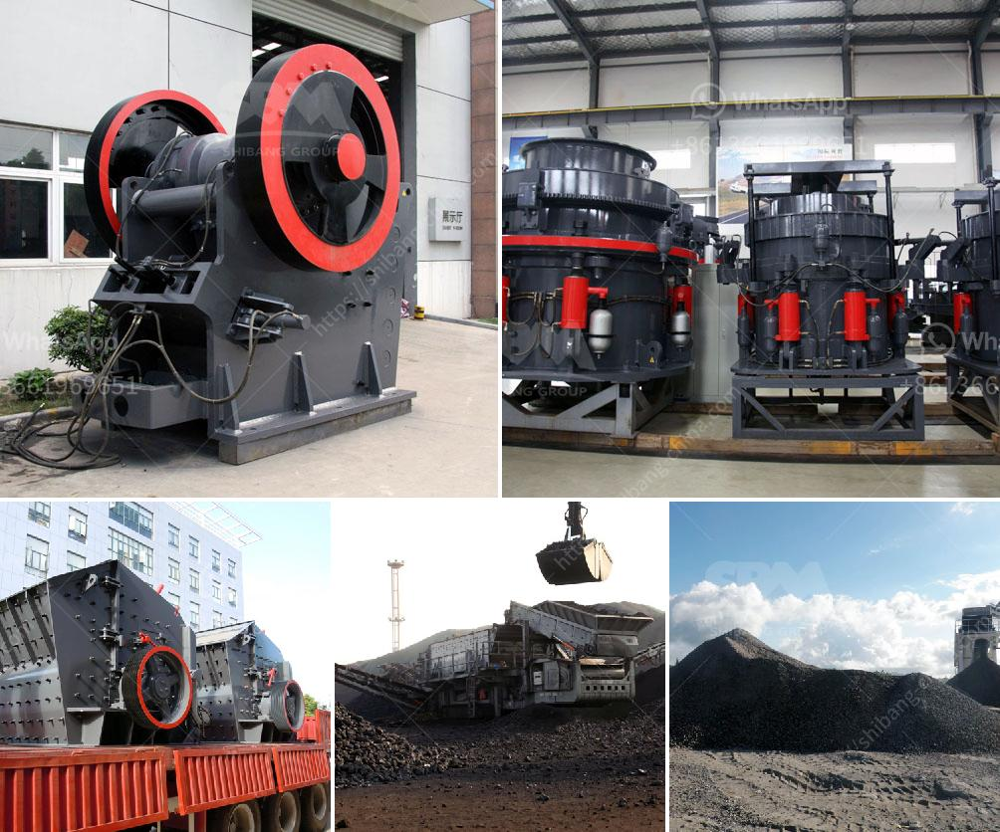

<h3>limestone crushing machine supplier</h3>
Limestone is a sedimentary rock composed mostly of calcium carbonate (CaCO3), usually in the form of calcite or aragonite. It is a popular building material used in construction, road building, and agriculture industries. Limestone is also used for cement production, lime production, and as a filler in various products.

To process limestone into fine particles, a limestone crushing machine is needed. A limestone crushing machine supplier should provide a range of solutions to meet the crushing requirements of various industries. The limestone crushers and mills are effective for direct-injection of dry sorbent lime or limestone during the CFB process.

When it comes to selecting a limestone crusher, one must consider several factors such as production capacity, investment costs, quality of the end product, maintenance requirements, and the specific needs of the application.

A reputable limestone crushing machine supplier will have a strong presence in the global market and a wealth of experience in the industry. They will offer a wide range of options in terms of equipment and technical solutions to suit different customer needs.

1. Quality and Durability: The supplier should be able to provide crushers that are built to withstand the rugged conditions of the limestone crushing process. The equipment should be made from high-quality materials that can withstand heavy loads and have a long service life.

2. High Production Capacity: A good supplier will offer crushers that can handle large volumes of limestone efficiently. This ensures the continuous operation of the production process and minimizes downtime.

3. Customizable Options: Different industries have different requirements when it comes to crushing limestone. A reliable supplier should have a range of crushers and mills with customizable options to meet the specific needs of each customer.

4. After-sales Service: A reputable supplier understands the importance of after-sales service and support. They should offer comprehensive technical support and maintenance services to ensure the smooth operation of the equipment and address any issues that may arise.

In conclusion, selecting the right limestone crushing machine supplier is crucial for efficient and cost-effective processing of limestone. It is important to find a supplier that offers high-quality equipment, customizable options, and excellent after-sales service. By doing so, businesses can ensure the optimal performance of their limestone crushing operations and maximize productivity.
<h3>Contact us</h3><ul><li><strong>Whatsapp:&nbsp;<a href="https://wa.me/8613661969651">+8613661969651</a></strong></li><li><a href="https://swt.shibang-china.com/?git&amp;zhl&amp;limestone crushing machine supplier"><strong>Online Service(chat now)</strong></a></li></ul><h3>Related</h3><ul><li><a href='700t h mobile crusher.md'>700t h mobile crusher</a></li><li><a href='mobile stone crushing machine for sale.md'>mobile stone crushing machine for sale</a></li><li><a href='jaw crushers in harare zimbabwe.md'>jaw crushers in harare zimbabwe</a></li><li><a href='conveyor belts in zambia.md'>conveyor belts in zambia</a></li><li><a href='with conveyor price philippines.md'>with conveyor price philippines</a></li></ul>