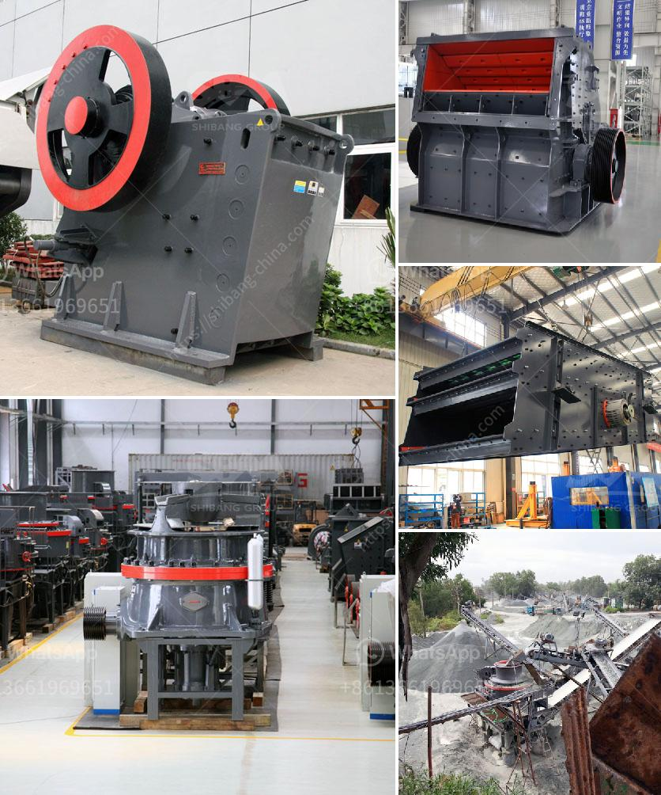

<h3>limestone crushing</h3>
Limestone is a sedimentary rock composed mostly of calcium carbonate (CaCO3). It is one of the most common rock types in the world and is mainly formed in warm, shallow marine environments. Limestone is widely used in construction materials and industrial applications due to its various characteristics, including high durability, low cost, and an abundance of calcium carbonate.

To utilize limestone effectively, it needs to be crushed into specific sizes for various applications. Crushing limestone is the first step in limestone processing, which involves extracting the stone from the earth's crust using various types of mining techniques. Once extracted, the limestone undergoes a series of crushing stages to reduce it to a size that can be used for various purposes.

The primary crushing stage is usually carried out by a jaw crusher, which is specially designed to handle large rocks. Jaw crushers have a large feed opening and a forceful crushing capability, allowing them to handle even the hardest of materials. After the initial crushing, the limestone is further reduced in size through secondary and tertiary crushing processes.

Secondary crushing involves the use of cone or impact crushers. These machines are designed to provide a high reduction ratio, which means that they can produce smaller sized particles. These crushers use compression and impact forces to break down the limestone into smaller fragments, enabling better handling and processing in subsequent stages.

Tertiary crushing, on the other hand, is carried out by tertiary impact crushers or cone crushers. These crushers produce even smaller particles and are primarily used to produce cubical-shaped aggregates for use in concrete and asphalt production. Tertiary crushers also help improve the quality of the final product by ensuring a consistent particle size distribution, reducing the amount of dust and fines.

In addition to size reduction, limestone crushing also plays a crucial role in enhancing the chemical properties of the stone. The process of crushing exposes a larger surface area of the limestone, allowing for more efficient reactions with other substances. This is particularly important in industries such as agriculture, where crushed limestone is used to neutralize acidic soils.

Furthermore, crushed limestone is commonly used as a base material in road construction and as an aggregate in concrete production. The crushed limestone provides stability and strength to the resulting structures while also allowing water to drain easily. This makes it an ideal material for both road construction and building foundations.

In conclusion, limestone crushing is a fundamental process in limestone processing. By crushing the limestone into specific sizes, it becomes more versatile and suitable for various applications in construction and other industries. The crushing process not only reduces the size of the limestone but also enhances its chemical properties, making it useful for agricultural purposes and improving the quality of the final product. Therefore, limestone crushing is a vital part of limestone utilization and plays a significant role in various industries.
<h3>Contact us</h3><ul><li><strong>Whatsapp:&nbsp;<a href="https://wa.me/8613661969651">+8613661969651</a></strong></li><li><a href="https://swt.shibang-china.com/?git&amp;zhl&amp;limestone crushing"><strong>Online Service(chat now)</strong></a></li></ul><h3>Related</h3><ul><li><a href='stone crusher capacity.md'>stone crusher capacity</a></li><li><a href='stone crusher machine plant for sale in pakistan.md'>stone crusher machine plant for sale in pakistan</a></li><li><a href='stone crusher plant operator job.md'>stone crusher plant operator job</a></li><li><a href='cost of small scale cement plant.md'>cost of small scale cement plant</a></li><li><a href='ball mill feed spout sale.md'>ball mill feed spout sale</a></li></ul>