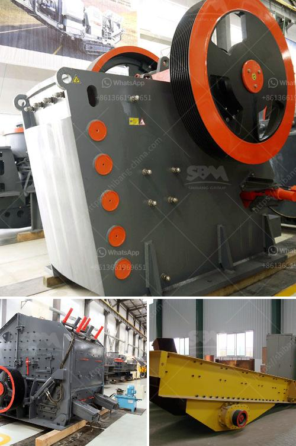

<h3>limestone grinding machine</h3>
Limestone is a sedimentary rock composed mainly of calcium carbonate (CaCO3). Limestone is widely used in various industries such as construction, architecture, and landscape. However, before it can be used in these industries, it must first be processed through a limestone grinding machine.

The limestone grinding machine can be ball mill, wet grinding mill and so on. Paired with limestone grinding mill, the classifier can further cut the calcium carbonate powder from the grinding mill. As a result, the limestone grinding plant can produce different sizes of fine and ultra fine calcium carbonate powder for different uses.

Since during the grinding process there will have dust, it will pollute the environment, so engineers must design a compact structure, so that the machine can provide a sealed workspace and a closed dust box to collect dust and dust in order to control the diffusion of dust and noise. At the same time, the machine should have a reasonable layout to facilitate maintenance and operation.

The limestone grinding machine is equipped with a high-efficiency cyclone collector. High-efficiency cyclone collector can effectively improve the dust collection efficiency and reduce the generation of dust-containing gas. After being ground and classified by the mill, the finished products are collected by collector and then deposited into the finished product silo.

The limestone grinding machine mainly includes feeding device, bucket elevator, storage bin, electric control panel, etc. According to customer's specific needs, we can choose limestone mill with different structures. For example, ball mill, vertical roller mill and ultrafine mill are all suitable grinding equipment for limestone grinding.

The choice of grinding equipment is very important in the whole process of limestone powder production plant. Choosing suitable grinding equipment is the key factor of ensuring the production efficiency of limestone powder. With more than 20 years of experience, SBM is a trustworthy manufacturer and supplier of mining equipment. SBM's grinding machine is not only of high quality, but also has a wide range of types, which can meet different production needs.

To ensure the high efficiency of limestone grinding mill, consumers should be careful to purchase the machines. There are certain standards and criteria that need to be appropriate when choosing the machines. The equipment needs to last longer in order to have the longest life span. Some manufacturers also use new materials and wear resistance to produce better machines. In order to purchase a suitable limestone grinding machine, it is necessary to analyze the needs of customers and choose the right equipment model according to the actual situation.

In conclusion, the limestone grinding machine provided by SBM Machinery is of high quality and efficiency. It can meet the production requirements of different limestone powder products and provide high-quality services for both large-scale and small-scale limestone processing plants.
<h3>Contact us</h3><ul><li><strong>Whatsapp:&nbsp;<a href="https://wa.me/8613661969651">+8613661969651</a></strong></li><li><a href="https://swt.shibang-china.com/?git&amp;zhl&amp;limestone grinding machine"><strong>Online Service(chat now)</strong></a></li></ul><h3>Related</h3><ul><li><a href='find fine jaw crusher in china.md'>find fine jaw crusher in china</a></li><li><a href='tons per year gypsum powder production line.md'>tons per year gypsum powder production line</a></li><li><a href='cement plant machinery manufacturers.md'>cement plant machinery manufacturers</a></li><li><a href='coal crusher manufacturing machine.md'>coal crusher manufacturing machine</a></li><li><a href='quarrying crusher machines.md'>quarrying crusher machines</a></li></ul>