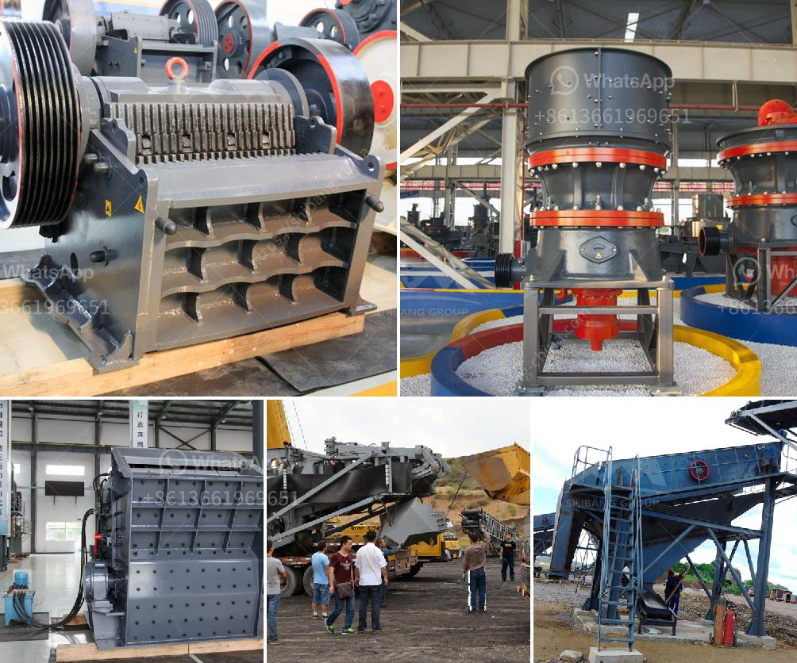

<h3>limestone grinding system</h3>
Limestone is a natural rock that is primarily composed of calcium carbonate (CaCO3). It is formed from the remains of marine organisms such as coral and shells. Over millions of years, under intense pressure and heat, these remains become compressed and solidify into limestone.

Limestone has a wide range of applications in various industries due to its unique physical and chemical properties. One common use of limestone is as a construction material in the form of crushed stone or gravel. It is used as a base for roads, driveways, and buildings. Limestone is also used in the production of cement, glass, and ceramics.

To meet the increasing demand for limestone-based products, efficient grinding systems are required to process the raw limestone into the desired size and quality. Limestone grinding systems typically consist of a ball mill with a classifier. The material that is to be grinded, usually limestone, is fed into the ball mill along with water. The water helps to transport the limestone particles into the grinding chamber, where they are ground into a fine powder.

The grinding chamber of the ball mill is lined with various types of steel or rubber plates. The material is impacted and ground by the balls as they cascade within the grinding chamber. The fineness of the grinded material depends on several factors, including the speed of rotation of the mill, the size and quantity of grinding balls, and the duration of the grinding process.

The grinded limestone powder is then separated from the water and other impurities through a classifier. The classifier ensures that only the desired particle size distribution is obtained. The fine limestone powder is collected in a baghouse or cyclone separator, while the larger particles are recirculated back into the ball mill for further grinding.

There are several benefits of using a limestone grinding system. Firstly, it allows for the efficient utilization of limestone resources, as it helps to transform raw limestone into a valuable product. Secondly, limestone grinding systems can produce high-quality limestone powder with a consistent particle size distribution. This is important for achieving optimal performance in applications such as cement production, where a certain fineness is required. Lastly, limestone grinding systems are relatively easy to operate and maintain, making them a cost-effective solution for limestone processing.

In conclusion, limestone grinding systems play a crucial role in the processing of limestone, allowing for the efficient production of various limestone-based products. These systems help to transform raw limestone into a fine powder through a combination of grinding and classification processes. With their ability to produce high-quality and consistent limestone powder, limestone grinding systems are an essential component of many industries.
<h3>Contact us</h3><ul><li><strong>Whatsapp:&nbsp;<a href="https://wa.me/8613661969651">+8613661969651</a></strong></li><li><a href="https://swt.shibang-china.com/?git&amp;zhl&amp;limestone grinding system"><strong>Online Service(chat now)</strong></a></li></ul><h3>Related</h3><ul><li><a href='germany made gypsum block wall equipment.md'>germany made gypsum block wall equipment</a></li><li><a href='how to start a cement factory.md'>how to start a cement factory</a></li><li><a href='crushing plant for sale in.md'>crushing plant for sale in</a></li><li><a href='used stone crusher machines.md'>used stone crusher machines</a></li><li><a href='concrete jaw crusher.md'>concrete jaw crusher</a></li></ul>