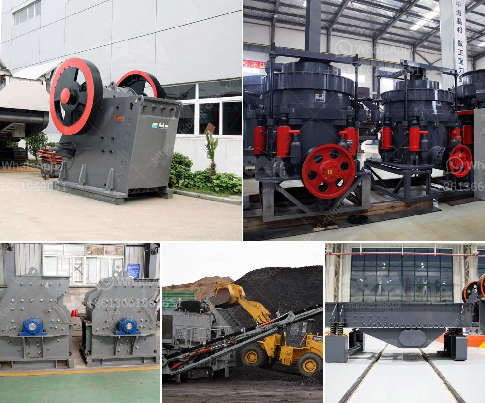

<h3>limestone mill for fertilizer</h3>
Limestone is an essential rock in various industries such as construction, agriculture, and even environmental. It is not only used as a building material but also has substantial benefits for crop production when processed into powder form. The limestone mill for fertilizer is a crucial machine for enhancing soil fertility and increasing agricultural yield.

In its powdered form, limestone is commonly known as agricultural lime and is a valuable soil amendment. It is primarily used to neutralize acidic soils and raise their pH levels. Acidic soils can hinder crop growth and limit nutrient availability. By adding limestone powder to these soils, farmers can effectively balance the pH levels, creating a more favorable environment for plants to thrive.

One of the key advantages of using limestone powder as a fertilizer is its slow-release nature. Unlike other synthetic fertilizers that provide an immediate nutrient boost, limestone gradually releases essential minerals such as calcium and magnesium. This gradual release ensures that plants receive a steady supply of nutrients over time, reducing the risk of nutrient runoff and waste.

Furthermore, limestone powder enriches the soil with crucial elements necessary for plant growth. Calcium, a key component of limestone, is vital for root development, cell division, and overall plant structure. Magnesium, another essential nutrient found in limestone, aids in the activation of enzymes required for key plant functions. By incorporating limestone powder into the soil, farmers can enhance nutrient absorption and promote healthy plant growth.

To obtain limestone powder suitable for agricultural use, a limestone mill is utilized. This mill crushes limestone into a fine powder and enables easy application to the soil. The pulverized limestone acts as a natural fertilizer, enriching the soil with necessary minerals required for optimal crop production.

In conclusion, the limestone mill for fertilizer plays a pivotal role in boosting crop production and improving soil fertility. With its slow-release nature and enriching properties, limestone powder aids in maintaining a balanced pH level and providing essential nutrients for plants. By utilizing this natural fertilizer, farmers can enhance their yields and contribute to sustainable agriculture practices.
<h3>Contact us</h3><ul><li><strong>Whatsapp:&nbsp;<a href="https://wa.me/8613661969651">+8613661969651</a></strong></li><li><a href="https://swt.shibang-china.com/?git&amp;zhl&amp;limestone mill for fertilizer"><strong>Online Service(chat now)</strong></a></li></ul><h3>Related</h3><ul><li><a href='calculate grinding ball diameter for ball mill.md'>calculate grinding ball diameter for ball mill</a></li><li><a href='gold mining company tanzania.md'>gold mining company tanzania</a></li><li><a href='quick lime powder machine.md'>quick lime powder machine</a></li><li><a href='ethiopia crusher jaw crusher.md'>ethiopia crusher jaw crusher</a></li><li><a href='iron ore beneficiation plant suppliers.md'>iron ore beneficiation plant suppliers</a></li></ul>