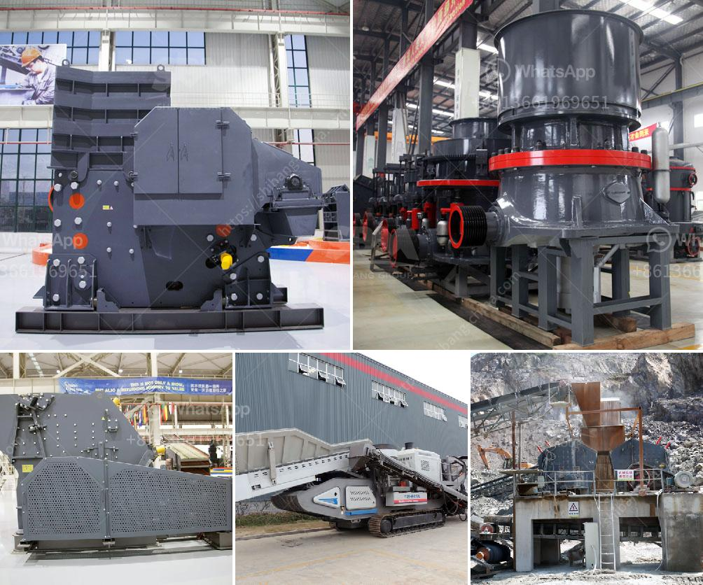

<h3>limestone powder manufacture machine</h3>
Limestone powder is widely used in various industries such as construction, agriculture, and cosmetics. Its versatility and ability to enhance the characteristics of other materials make it a highly sought-after product. The manufacturing process of limestone powder requires specialized machinery to ensure a high-quality end product that meets the industry standards.

Limestone powder manufacture machines play a crucial role in the production process. These machines crush and grind limestone into a fine powder, making it suitable for various applications. The crushing process involves a series of crushers that break down the larger limestone rocks into smaller pieces. These smaller pieces are then further reduced in size by grinding mills.

One of the key machines used in the production of limestone powder is the Raymond mill. This mill is specifically designed to grind limestone to various sizes ranging from 200 to 400 mesh. Raymond mills use centrifugal force and a rotating roller to grind limestone. The final product is a fine powder that is suitable for use in various industries.

Another important machine used in limestone powder manufacturing is the air classifier. This machine is responsible for separating the fine powder from the coarser particles. The fine powder is then collected and stored, while the coarser particles are sent back to the grinding mill for further processing. The air classifier ensures that the desired particle size distribution is achieved, resulting in a high-quality limestone powder.

In addition to these machines, limestone powder manufacturing also requires other equipment such as crushers, feeders, and conveyors. These machines work together to ensure a smooth and efficient production process.

In conclusion, limestone powder manufacture machines are essential for the production of high-quality limestone powder. These machines crush, grind, and separate limestone into a fine powder that is suitable for various applications. The use of specialized machinery ensures that the end product meets industry standards and satisfies the needs of different industries.
<h3>Contact us</h3><ul><li><strong>Whatsapp:&nbsp;<a href="https://wa.me/8613661969651">+8613661969651</a></strong></li><li><a href="https://swt.shibang-china.com/?git&amp;zhl&amp;limestone powder manufacture machine"><strong>Online Service(chat now)</strong></a></li></ul><h3>Related</h3><ul><li><a href='crusher machine for sale in pakistan.md'>crusher machine for sale in pakistan</a></li><li><a href='manufacturers of conveyor belts in malaysia.md'>manufacturers of conveyor belts in malaysia</a></li><li><a href='vibratory feeder manufacturer china.md'>vibratory feeder manufacturer china</a></li><li><a href='kaolin raymond mill price.md'>kaolin raymond mill price</a></li><li><a href='total cost of stone crushing unit in india.md'>total cost of stone crushing unit in india</a></li></ul>