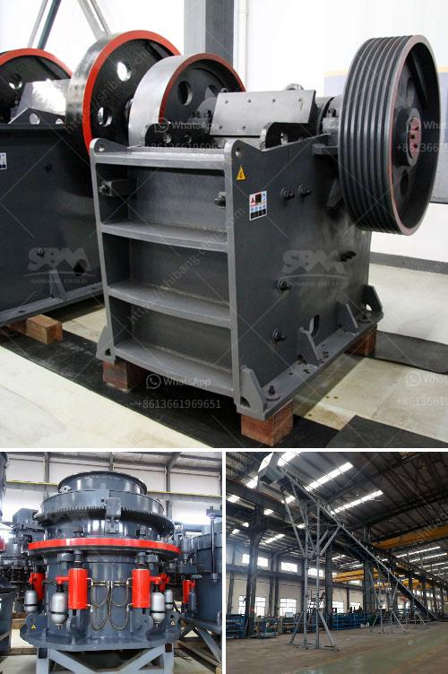

<h3>limestone processing plant</h3>
Limestone is an essential mineral commodity of national importance. Some of the many products made using limestone are shown in this photograph: breakfast cereal, paint, calcium supplement pills, a marble tabletop, antacid tablets, high-quality paper, white roofing granules, and Portland cement.

Limestone is a versatile and valuable resource that plays a key role in various industries and applications. The demand for limestone products is continually growing, leading to the establishment of limestone processing plants worldwide. In this article, we will discuss the limestone processing plant and its significance in various industries.

A limestone processing plant is a facility where limestone is crushed, dried, and separated for various applications. The processed limestone is used in power plants, cement production, metallurgical applications, chemical industries, and many more. Limestone is a sedimentary rock, primarily composed of calcium carbonate, which is essential for various industrial purposes.

The limestone processing plant starts with the extraction of limestone from mines or quarries. Large pieces of limestone are first broken into smaller fragments, which are then taken to a primary crusher for size reduction. After crushing, the limestone is sorted by size and transported to the drying and grinding units for further processing.

In the drying unit, the limestone is heated using hot gases to reduce its moisture content. This ensures that the limestone is suitable for subsequent grinding processes. The dried limestone is then ground into a fine powder in the grinding unit. This powder, also known as limestone flour or limestone dust, is used in various applications, including agriculture, animal feed, and building materials.

One of the major applications of processed limestone is in the cement industry. Cement production requires the use of limestone as a key ingredient. The limestone powder obtained from the processing plant is mixed with other materials, such as clay, shale, and iron ore, in the right proportions to manufacture cement. The calcium carbonate present in limestone acts as a binder, contributing to the strength and durability of the final product.

Apart from the cement industry, limestone also finds widespread usage in the manufacturing of steel and iron. The high calcium content of limestone makes it an ideal fluxing agent during the steelmaking process. It helps remove impurities, such as silica, alumina, and phosphorus, from iron ore, thereby improving the quality of steel.

Limestone is also used in the production of glass, fertilizer, and as a soil conditioner in agriculture. In the glass industry, limestone is added to the silicate material mix to reduce melting temperatures and improve transparency. In agriculture, limestone is applied to acidic soils to reduce their acidity and improve nutrient availability for plants.

In conclusion, limestone processing plants play a vital role in meeting the increasing demand for limestone-derived products. These plants process limestone into various forms, such as powder, granules, or pellets, for use in diverse industries like cement, steel, glass, and agriculture. The versatility of limestone and its abundance make it a valuable resource and a cornerstone of various industrial processes that contribute to modern living and infrastructure development.
<h3>Contact us</h3><ul><li><strong>Whatsapp:&nbsp;<a href="https://wa.me/8613661969651">+8613661969651</a></strong></li><li><a href="https://swt.shibang-china.com/?git&amp;zhl&amp;limestone processing plant"><strong>Online Service(chat now)</strong></a></li></ul><h3>Related</h3><ul><li><a href='dolomite powder machine.md'>dolomite powder machine</a></li><li><a href='complete stone processing equipment stone crusher 100tph.md'>complete stone processing equipment stone crusher 100tph</a></li><li><a href='ball mill in work.md'>ball mill in work</a></li><li><a href='aggregate crusher plant keesara.md'>aggregate crusher plant keesara</a></li><li><a href='crushing and screening companies in south africa.md'>crushing and screening companies in south africa</a></li></ul>