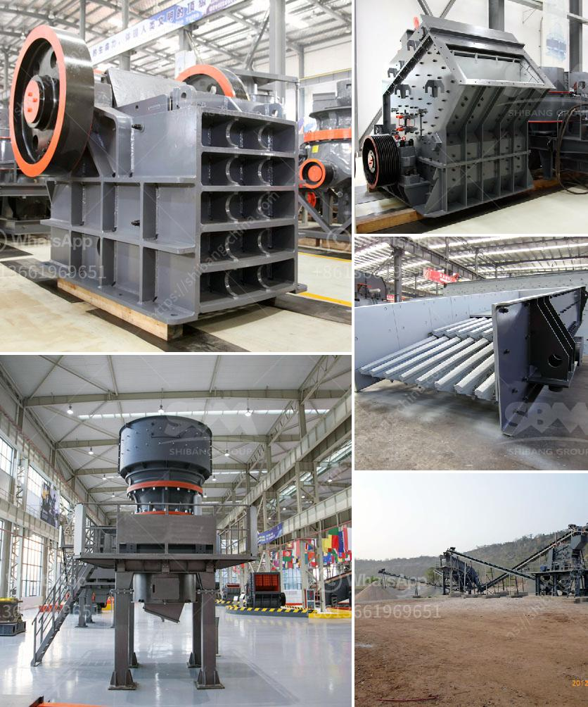

<h3>limestone quarry machines and equipments</h3>
Limestone is a sedimentary rock composed mainly of calcium carbonate (CaCO3), usually in the form of calcite or aragonite. It may contain considerable amounts of magnesium carbonate (dolomite) as well. Limestone quarrying and extraction of lime from its ore is a major industry worldwide, and the equipment used in the process can vary greatly in size and type.

Limestone quarrying involves the use of explosive charges to dislodge the rock from the land. The use of heavy drilling machines and various mining tools is common. This equipment includes large trucks, loaders, excavators, crushers, and many other types of machinery, which require regular maintenance and proper care.

The first step in limestone quarrying is the removal of overburden, the top soil, vegetation, and layers of unwanted rock. This process is usually done using heavy equipment, such as excavators, bulldozers, and dump trucks. These machines are used to clear the area, making it easier to access the limestone deposits beneath.

Once the overburden is removed, the next step is to drill holes into the limestone rock. This is done using drilling machines equipped with diamond-tipped drill bits. These drills are capable of penetrating several meters into the rock, creating holes for explosives to be placed. The size and depth of the holes depend on the specific requirements of the quarry.

After drilling, explosives are inserted into the holes and detonated. The resulting blast breaks the limestone into smaller pieces, which can then be transported for further processing. Large trucks and loaders are used to load the fragmented limestone onto haulage vehicles, which transport it to the primary crusher.

The primary crusher reduces the size of the limestone pieces into manageable chunks. These chunks are then transported to secondary crushers or hammer mills for further size reduction. After further processing, the limestone is crushed into different products, such as aggregates for construction, agricultural lime, or a powder called quicklime, which is used in various industries.

The specific equipment used in limestone quarrying depends on factors such as the desired final product, the size of the quarry, and the nature of the deposit. However, some common machines and equipment used in quarrying limestone include:

1. Excavators: These large machines are used to dig and remove the overburden and extract the limestone deposits.

2. Bulldozers: They are used to push and remove the topsoil, vegetation, and unwanted rock from the quarry area.

3. Dump Trucks: These heavy-duty trucks are used to transport the fragmented limestone from the quarry to the crusher or processing plant.

4. Crushers: Various types of crushers are used to break down the limestone into more manageable pieces, such as jaw crushers, impact crushers, and cone crushers.

5. Hammer Mills: These machines grind the crushed limestone into a fine powder, which is then used as a raw material in various industries.

6. Screening Machines: Vibrating screens or trommel screens are used to separate the different sizes of limestone particles.

7. Conveyors: These machines are used to transport the freshly extracted limestone or crushed limestone to different areas within the quarry or processing plant.

In conclusion, limestone quarrying requires the use of various machines and equipment, which greatly depend on the nature and size of the quarry. These machines help extract, transport, and process the limestone into different products, fulfilling the demands of various industries worldwide. Proper maintenance and care of these machines are crucial to ensure their longevity and efficient operation.
<h3>Contact us</h3><ul><li><strong>Whatsapp:&nbsp;<a href="https://wa.me/8613661969651">+8613661969651</a></strong></li><li><a href="https://swt.shibang-china.com/?git&amp;zhl&amp;limestone quarry machines and equipments"><strong>Online Service(chat now)</strong></a></li></ul><h3>Related</h3><ul><li><a href='mica crusher production plants.md'>mica crusher production plants</a></li><li><a href='diesel engines grinding mills south africa.md'>diesel engines grinding mills south africa</a></li><li><a href='jaw crusher supplier in the philippines.md'>jaw crusher supplier in the philippines</a></li><li><a href='fine powder grinding mill.md'>fine powder grinding mill</a></li><li><a href='hammer mill santa cross.md'>hammer mill santa cross</a></li></ul>