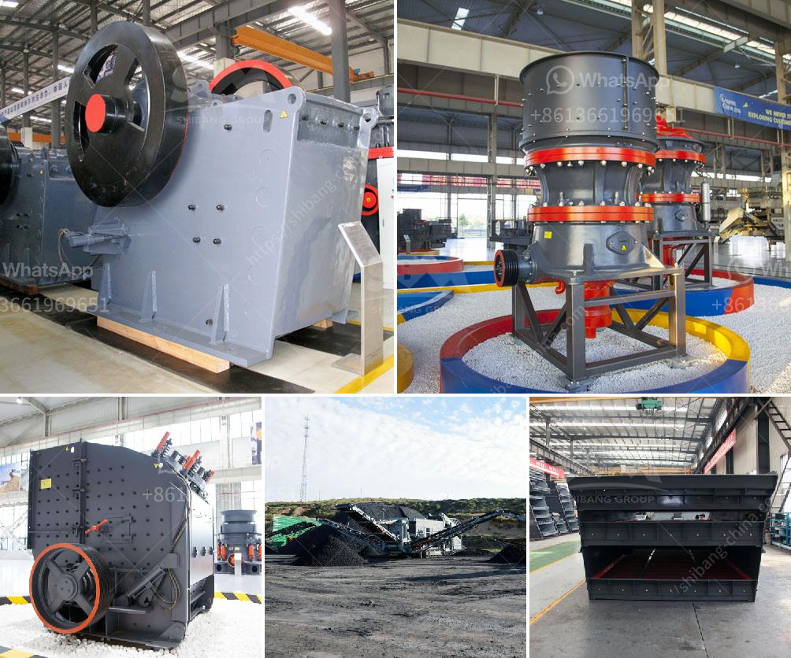

<h3>limestone treatment plant</h3>
In recent years, the need for sustainable and efficient water treatment methods has become increasingly evident. With the growing global population and the escalating pollution of our water sources, finding adequate solutions to provide safe and clean drinking water has become a critical challenge. One such solution that has gained popularity in the field of water purification is the limestone treatment plant.

Limestone is a sedimentary rock composed primarily of calcium carbonate. It has been widely used in various industries for centuries due to its versatility and abundance. However, it is now being recognized as an effective and eco-friendly material for water treatment.

The process of treating water with limestone involves a series of chemical reactions that help eliminate impurities and contaminants. The water passes through a bed of crushed limestone or limestone chips, where the chemical composition of the limestone interacts with the pollutants present in the water.

One of the key advantages of using limestone for water treatment is its ability to remove heavy metals, such as lead, mercury, and arsenic. These harmful substances are often found in contaminated water sources and can have detrimental effects on human health. The chemical reactions that occur during the treatment process enable the limestone to bind with these metals, effectively reducing their concentration and making the water safe for consumption.

Additionally, limestone treatment plants are efficient in removing other common impurities, such as bacteria, viruses, and organic matter. The porous structure of limestone allows for the physical and biological processes to take place, further purifying the water. This makes limestone treatment plants particularly suitable for areas where water sources are prone to microbial contamination or organic pollution.

Moreover, limestone treatment plants are cost-effective and require minimal maintenance compared to other water treatment methods. The natural abundance of limestone and its affordability make it a sustainable choice for large-scale water purification projects. Furthermore, the simple design and operation of limestone treatment plants make them accessible and viable options for communities with limited resources.

Furthermore, limestone itself acts as a natural buffer, helping to stabilize the pH levels of the treated water. This is particularly important, as variations in pH can have adverse effects on the taste, quality, and overall safety of drinking water. By maintaining a stable pH, limestone treatment plants ensure that the end product is not only safe to consume but also pleasant to taste.

In conclusion, limestone treatment plants offer a sustainable and efficient solution for water purification. They leverage the natural properties of limestone to eliminate pollutants and impurities, making the water safe for human consumption. The cost-effectiveness, low maintenance requirements, and versatility of these plants make them suitable for both large-scale water treatment projects and smaller community-based initiatives. As water scarcity and pollution continue to pose significant challenges, embracing eco-friendly solutions like limestone treatment plants becomes crucial to ensure a safe and sustainable water supply for future generations.
<h3>Contact us</h3><ul><li><strong>Whatsapp:&nbsp;<a href="https://wa.me/8613661969651">+8613661969651</a></strong></li><li><a href="https://swt.shibang-china.com/?git&amp;zhl&amp;limestone treatment plant"><strong>Online Service(chat now)</strong></a></li></ul><h3>Related</h3><ul><li><a href='coal crushing and screening plants.md'>coal crushing and screening plants</a></li><li><a href='price list of cone crushers made in china.md'>price list of cone crushers made in china</a></li><li><a href='cheap concrete crusher sale kenya.md'>cheap concrete crusher sale kenya</a></li><li><a href='mobile crusher in uae for sale.md'>mobile crusher in uae for sale</a></li><li><a href='stone crusher of mandibila in argentina.md'>stone crusher of mandibila in argentina</a></li></ul>