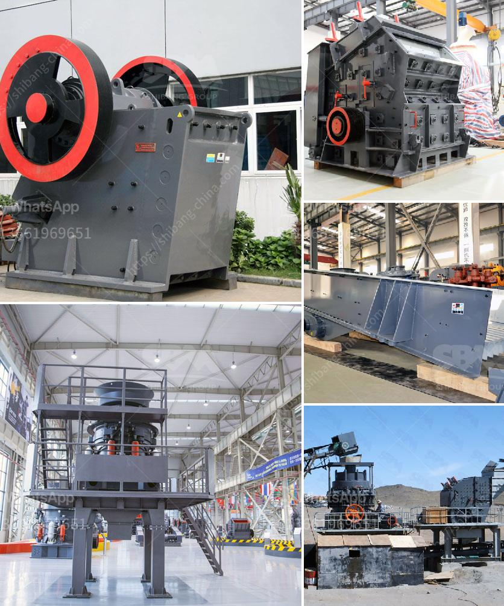

<h3>list gold mining equipment and machines</h3>
Gold mining equipment is essential for the efficient and professional gold miner. Gold miners use a variety of different equipment to prospect for gold. Here is an overview of the various kinds of gold mining equipment that you may require for your next mining adventure.

A gold trommel is a machine used to separate the gold from gravel and other debris. The trommel screen consists of a rotating drum that contains a series of screens of different sizes. As the materials pass through the screens, the smaller particles are able to fall through the openings while the larger particles are retained. This separates the gold from the rest of the gravel and allows it to be collected.

A sluice box is another essential piece of equipment used for placer mining. It is a long, narrow box that traps gold as running water passes through it. The idea behind the sluice box is to channel water with high velocity and force it through a series of riffles to capture any gold in the gravel. The riffles create barriers that slow down the water flow and allow the gold to sink and be captured.

A gold pan is the most basic and essential piece of equipment for gold prospecting. It is a shallow, wide-bottomed pan made of either metal or plastic. Gold pans are used to separate gold from other materials in placer deposits by swirling water around in the pan, causing the gold to sink to the bottom while washing away the unwanted materials.

A drywasher is a common tool used in dry placer mining operations. It uses air and vibration to separate gold from the lighter materials. A drywasher consists of a box with a hopper at the top, where the raw material is fed into the machine. Inside the box, a series of riffles and screens shake and vibrate to separate the gold from the sand and gravel.

A dredge is a machine used for extracting gold in placer deposits by using water and suction to excavate and transport the gold-bearing material. Dredges are typically equipped with a suction pipe, sluice box, and a power unit to move the material from the underwater location to the surface.

A metal detector is often used in gold mining to locate and identify gold nuggets and specimens that may be hidden in the ground. Metal detectors utilize electromagnetic fields to detect metal objects buried underground. Many gold prospectors use metal detectors to quickly and efficiently search for gold nuggets in mineralized areas.

These are just a few examples of the various types of equipment and machines used in gold mining. Each piece of equipment serves a specific purpose to help miners efficiently extract and process gold from the ground. Whether you are a novice or experienced gold miner, it is important to have the right equipment to maximize your chances of success.
<h3>Contact us</h3><ul><li><strong>Whatsapp:&nbsp;<a href="https://wa.me/8613661969651">+8613661969651</a></strong></li><li><a href="https://swt.shibang-china.com/?git&amp;zhl&amp;list gold mining equipment and machines"><strong>Online Service(chat now)</strong></a></li></ul><h3>Related</h3><ul><li><a href='silicon ore processing equipment.md'>silicon ore processing equipment</a></li><li><a href='mining equipment for sale west africa.md'>mining equipment for sale west africa</a></li><li><a href='mobile stone crusher machine europa.md'>mobile stone crusher machine europa</a></li><li><a href='crushing processing equipment.md'>crushing processing equipment</a></li><li><a href='china hammer mill.md'>china hammer mill</a></li></ul>