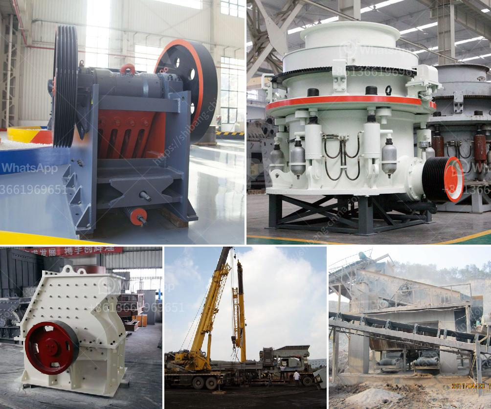

<h3>list of limestone mining companies in china</h3>
China is the world's largest producer and consumer of limestone, an essential ingredient for the manufacturing of cement. Boasting abundant limestone reserves, China has numerous mining companies that supply the domestic and global market with this versatile mineral. Here, we present a list of limestone mining companies in China.

CRC is the majority shareholder of China Resources Cement, one of the largest cement producers in China. The company operates several limestone mines across China, extracting high-quality limestone for cement production. With its extensive distribution network, CRC caters to both domestic and international markets.

Anhui Conch Cement is one of the largest cement producers in the world and holds vast limestone resources. The company operates numerous limestone mines in China, ensuring a consistent supply of limestone for its cement plants. With a focus on sustainability, Anhui Conch Cement adopts advanced mining techniques to minimize environmental impact.

CNBM is a state-owned company engaged in the production of building materials. The company operates multiple limestone mines across China, contributing to China's self-sufficiency in limestone supply. CNBM also exports limestone to various countries, bolstering China's position in the global market.

Jidong Development Group is one of the leading cement producers in China. With extensive limestone reserves, the company operates several limestone mines in China. Jidong Development Group constantly invests in advanced mining technology to maximize efficiency and minimize environmental impact.

China Shanshui Cement Group is a major cement manufacturer with significant limestone resources. The company operates limestone mines to ensure a steady supply of high-quality limestone for its cement production facilities. With a focus on technological innovation, Shanshui Cement contributes to sustainable limestone mining practices.

Huaxin Cement is a well-known cement producer in China with a strong emphasis on sustainability. The company operates limestone mines in multiple regions, ensuring a stable supply of limestone. Huaxin Cement has embraced environmentally friendly mining techniques to reduce carbon emissions and minimize ecological disruption.

TCC International Holdings engages in the production and distribution of cement and limestone products. The company owns limestone mines in different parts of China, extracting limestone for manufacturing cement and other industrial applications. TCC International Holdings adheres to strict safety measures to ensure the well-being of its employees and the surrounding environment.

In conclusion, China has numerous limestone mining companies that contribute to its status as the world's largest producer and consumer of limestone. These companies employ advanced mining techniques and prioritize sustainability to ensure a steady supply of high-quality limestone for various industries, such as cement production. With their extensive distribution networks, these companies play a crucial role in meeting domestic and international demand for limestone.
<h3>Contact us</h3><ul><li><strong>Whatsapp:&nbsp;<a href="https://wa.me/8613661969651">+8613661969651</a></strong></li><li><a href="https://swt.shibang-china.com/?git&amp;zhl&amp;list of limestone mining companies in china"><strong>Online Service(chat now)</strong></a></li></ul><h3>Related</h3><ul><li><a href='wet ball milling process.md'>wet ball milling process</a></li><li><a href='stone crusher machinery china.md'>stone crusher machinery china</a></li><li><a href='impact crushers saudi.md'>impact crushers saudi</a></li><li><a href='stone powder making machine in india.md'>stone powder making machine in india</a></li><li><a href='50 tpd iron crusher machinery cost.md'>50 tpd iron crusher machinery cost</a></li></ul>