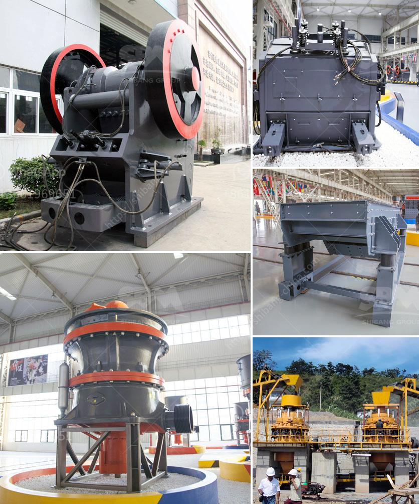

<h3>listing price tons per hour screw conveyor</h3>
A screw conveyor is an essential piece of equipment used in various industries to move materials efficiently and effectively. One crucial factor to consider when investing in a screw conveyor is its listing price, specifically in terms of tons per hour (TPH) capacity. In this article, we will delve into the significance of TPH in screw conveyor pricing and explore the factors that affect the listing price of a screw conveyor.

Screw conveyors are versatile machines that can handle a wide range of materials, from dry, fine powders to sticky, wet materials. They consist of a rotating helical screw blade contained within a tube or trough, which moves materials along the conveyor by rotating the screw. The capacity of a screw conveyor is typically measured in TPH, which represents the maximum amount of material it can handle within an hour.

The TPH capacity directly influences the listing price of a screw conveyor. As the TPH capacity increases, so does the complexity of the design and the materials required for construction. This results in a higher listing price due to the additional engineering, materials, and manufacturing processes involved in producing a conveyor with a higher capacity.

Other factors that impact the listing price of a screw conveyor include the size and length of the conveyor, type of material being transported, and any specific customization required. A larger and longer conveyor will require more materials, driving up the cost. Similarly, if the conveyor needs to handle abrasive or corrosive materials, it may require additional protective coatings or specialized materials, which can raise the listing price.

Customization can also affect the pricing of a screw conveyor. Some businesses may require specific modifications to suit their unique needs or space constraints. This could include specialized hoppers or discharges, variable speed control, or integrated safety features. Any customization beyond the standard design will increase the listing price.

It is essential to carefully evaluate your specific requirements and budget constraints when considering the listing price of a screw conveyor. While it may be tempting to opt for a lower capacity conveyor to save on costs, it is crucial to be realistic about your material handling needs. Choosing a conveyor with insufficient capacity can lead to operational inefficiencies, production delays, and increased maintenance costs in the long run.

To ensure you are getting the best value for your money, it is advisable to compare quotes from multiple manufacturers and discuss your needs with an experienced engineer or supplier. They can help you assess the most suitable capacity for your application and provide guidance on any necessary customizations. Additionally, look for reputable manufacturers with a track record of producing high-quality screw conveyors that are durable, reliable, and offer good after-sales service.

In conclusion, the listing price of a screw conveyor is closely tied to its capacity in tons per hour. As the TPH capacity increases, so does the complexity of construction and the materials required, resulting in a higher listing price. Additional factors include the size, length, material type, and any customizations required. Investing in a screw conveyor that meets your specific needs, capacity requirements, and budget will ensure optimal material handling efficiency and long-term cost savings.
<h3>Contact us</h3><ul><li><strong>Whatsapp:&nbsp;<a href="https://wa.me/8613661969651">+8613661969651</a></strong></li><li><a href="https://swt.shibang-china.com/?git&amp;zhl&amp;listing price tons per hour screw conveyor"><strong>Online Service(chat now)</strong></a></li></ul><h3>Related</h3><ul><li><a href='ball mill iran mining.md'>ball mill iran mining</a></li><li><a href='30 x 42 portable jaw crusher for sale.md'>30 x 42 portable jaw crusher for sale</a></li><li><a href='stone crusher hammer crusher.md'>stone crusher hammer crusher</a></li><li><a href='used crusher for sale kenya.md'>used crusher for sale kenya</a></li><li><a href='chalk manufacturing machinechalk mining machinery.md'>chalk manufacturing machinechalk mining machinery</a></li></ul>