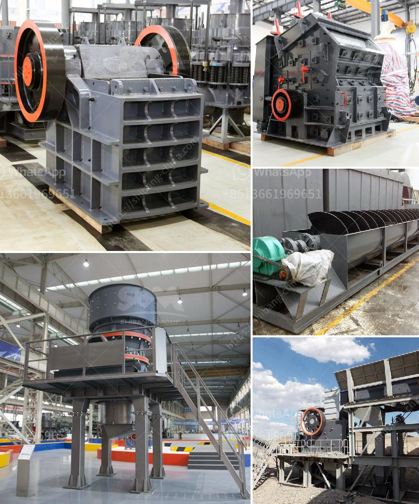

<h3>lm vertical grinding mills</h3>
With the development of infrastructure construction, the demand for sand and gravel aggregate continues to increase, which has led to the development of the grinding equipment industry. As a professional manufacturer of grinding equipment, SBM Machinery has designed and developed the LM series vertical grinding mills. This machine integrates crushing, drying, grinding, grading, and conveying, greatly improving the efficiency of grinding.

1. Wide Application: LM series vertical grinding mills are widely used in grinding non-flammable and non-explosive materials under 9.3(the Moh's hardness), such as grinding quartz, feldspar, calcite, talcum, barite, fluorite, iron ore, copper ore quartz, slag, cement clinker, zircon sand, fly ash and carborundum, coal, etc. The moisture content of the materials does not exceed 10%.

2. High Grinding Efficiency: The grinding roller directly grinds materials on the grinding disc, which has low energy consumption and saves energy by 30% to 40% compared with the traditional grinding mill. The materials stay in the grinding zone for a short time, which ensures efficient grinding.

3. Multi-functional Design: The structure design of LM vertical grinding mills is simple, compact, and lightweight. It combines crushing, drying, grinding, grading, and conveying. It has the advantages of small occupation area, low investment cost, and high drying ability.

4. Fully Automatic Control: The pressure device in the vertical mill is designed to automatically adjust the grinding pressure of the grinding roller, which makes the grinding process more advanced and stable. The complete set of equipment can be controlled remotely to greatly reduce the labor intensity of operators.

5. High Environmental Protection Standard: LM vertical grinding mills are equipped with dust collection devices to effectively control the dust emission during the production process. The noise is low, and the operation is stable, which creates a comfortable working environment.

As an advanced grinding equipment, LM vertical grinding mills not only solve the traditional disadvantages of low productivity and high energy consumption in the grinding process but also greatly improve the grinding efficiency, reduce the labor intensity of operators, and save project investment costs. With the advantages of wide application and high environmental protection, LM vertical grinding mills have become the preferred choice for many grinding equipment users. SBM Machinery will continue to innovate and improve the equipment to meet the needs of customers and contribute to the development of the grinding industry.
<h3>Contact us</h3><ul><li><strong>Whatsapp:&nbsp;<a href="https://wa.me/8613661969651">+8613661969651</a></strong></li><li><a href="https://swt.shibang-china.com/?git&amp;zhl&amp;lm vertical grinding mills"><strong>Online Service(chat now)</strong></a></li></ul><h3>Related</h3><ul><li><a href='material used in vertical mill.md'>material used in vertical mill</a></li><li><a href='limestone crushing equipment.md'>limestone crushing equipment</a></li><li><a href='chrome ore refinery processing plant.md'>chrome ore refinery processing plant</a></li><li><a href='bentonite plant dimensions.md'>bentonite plant dimensions</a></li><li><a href='crushing plant for sale in.md'>crushing plant for sale in</a></li></ul>