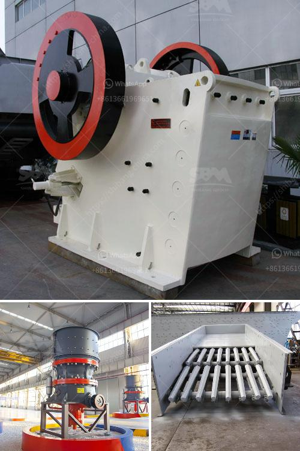

<h3>logo of stone crusher</h3>
The development of a logo is one of the most important steps in establishing a brand identity for a company, product, or service. It serves as a visual representation of the organization's values, mission, and overall personality. When it comes to the logo of a stone crusher, it needs to convey the ruggedness and strength associated with the industry while also reflecting the company's commitment to quality and innovation.

A stone crusher is a machine used to convert large stones into smaller sizes that can be used in construction or other purposes. There are several types of stone crushing machines, which are differentiated based on the stone processing stages, namely primary crusher, secondary crusher, and tertiary crusher. Each type of stone crusher has a different function, and they work together to produce crushed stone of various sizes.

While designing the logo for a stone crusher, it is important to keep in mind the nature of the business. The logo should symbolize strength, durability, and reliability. Some common elements that can be incorporated into the logo design include stones, rocks, hammers, gears, or heavy machinery. Combining these elements in a creative and visually striking way can help create a logo that is instantly recognizable and memorable.

The color scheme for the logo should also be carefully considered. Earthy tones such as brown, gray, or black can evoke a sense of ruggedness and durability. Additionally, these colors can be associated with the natural materials that are processed by stone crushers. Contrastingly, using bold or vibrant colors can evoke the innovation and modernity that a company may bring to the stone crushing industry. The choice of color should align with the company's overall branding strategy and target demographic.

Typography is another crucial aspect of logo design. The font used for the logo should be clear and easily readable. It should reflect the professionalism and reliability of the company while also being visually appealing. Depending on the overall design and concept, a combination of bold and sleek fonts can be used to create a modern and engaging logo.

In conclusion, the logo of a stone crusher should effectively communicate the purpose and values of the company. It should embody strength, durability, and reliability, while also reflecting the company's commitment to innovation and quality. By incorporating elements such as stones, rocks, hammers, gears, and heavy machinery into the logo design, one can creatively represent the stone crushing industry. Careful consideration of color scheme and typography will help ensure that the logo stands out and leaves a lasting impression on potential customers.
<h3>Contact us</h3><ul><li><strong>Whatsapp:&nbsp;<a href="https://wa.me/8613661969651">+8613661969651</a></strong></li><li><a href="https://swt.shibang-china.com/?git&amp;zhl&amp;logo of stone crusher"><strong>Online Service(chat now)</strong></a></li></ul><h3>Related</h3><ul><li><a href='quarry crusher in zambia.md'>quarry crusher in zambia</a></li><li><a href='mobile cone crushing station for sale.md'>mobile cone crushing station for sale</a></li><li><a href='50tpd mini cement plant cost in india.md'>50tpd mini cement plant cost in india</a></li><li><a href='mobile crusher track.md'>mobile crusher track</a></li><li><a href='conveyor belts in peru.md'>conveyor belts in peru</a></li></ul>