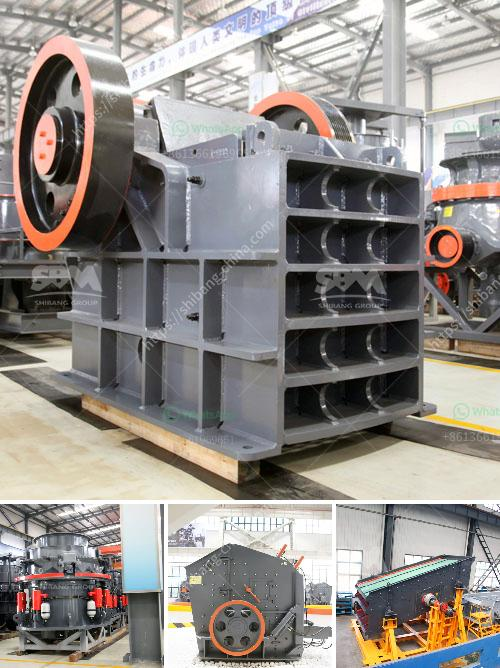

<h3>m sand manufacturing project report</h3>
M sand, short for manufactured sand, is a substitute for river sand in construction projects. The demand for manufactured sand is increasing rapidly due to the depletion of natural sand resources. In order to meet this demand, many entrepreneurs have started manufacturing artificial sand.

The M sand manufacturing project involves various processes such as crushing, screening, and washing. Initially, large-sized stones are crushed and then washed to remove dirt and impurities. The next step is screening, where the sand is separated based on its desired size. The final product is obtained after washing and drying the separated sand.

One of the major advantages of using M sand in construction is that it is free from impurities such as silt and clay, which can affect the strength and durability of the concrete. It also has a consistent particle size distribution, which helps in achieving better workability of the concrete mix.

The manufacturing process of M sand is environmentally friendly as it does not involve any excavation of river beds, which in turn helps in preserving the natural resources. Moreover, it also reduces the impact on river ecosystems and prevents the displacement of wildlife.

A well-executed M sand manufacturing project report is crucial for entrepreneurs who want to set up a manufacturing unit. It helps in understanding the feasibility of the project and assists in securing financial assistance from banks or other financial institutions.

The project report should include detailed information about the manufacturing process, market potential, investment required, machinery and equipment, raw materials, and manpower. It should also provide an analysis of the market demand, projected revenue, and profitability.

In conclusion, the M sand manufacturing project is a profitable venture for entrepreneurs looking to enter the construction industry. It not only helps in meeting the increasing demand for sand but also contributes to sustainable development by reducing the reliance on natural resources. A well-prepared project report is essential for the success of the project and can assist in obtaining financial support.
<h3>Contact us</h3><ul><li><strong>Whatsapp:&nbsp;<a href="https://wa.me/8613661969651">+8613661969651</a></strong></li><li><a href="https://swt.shibang-china.com/?git&amp;zhl&amp;m sand manufacturing project report"><strong>Online Service(chat now)</strong></a></li></ul><h3>Related</h3><ul><li><a href='limestone coal grinding machinery manufacture in india.md'>limestone coal grinding machinery manufacture in india</a></li><li><a href='hydraulic cone crusher application.md'>hydraulic cone crusher application</a></li><li><a href='mtm 160 ball mill spare parts suppliers in india.md'>mtm 160 ball mill spare parts suppliers in india</a></li><li><a href='stone crusher hammer crusher.md'>stone crusher hammer crusher</a></li><li><a href='crusher for pozzuolana.md'>crusher for pozzuolana</a></li></ul>