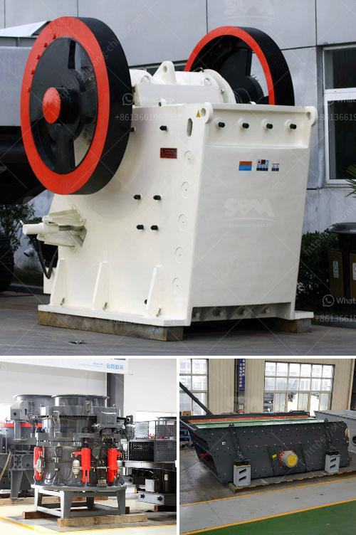

<h3>machinery for bentonite crusher production</h3>
Bentonite is a highly absorbent and versatile clay that is used in various industries including mining, construction, and drilling. In recent years, the demand for bentonite has been increasing as the need for its applications continues to grow. To meet this demand, machinery for bentonite crusher production has become essential.

Bentonite crushers are used to crush the large chunks of bentonite into smaller particles commonly 6 mm and then further processed to various fineness by the bentonite grinding mills. The bentonite crushers consist of jaw crusher, impact crusher, cone crusher, and mobile crusher.

Generally, the jaw crusher is used as the primary crusher, and impact crusher or cone crusher is used as the secondary crusher. As a professional manufacturer of mining equipment, SBM can offer high-quality crushers and grinding mills for the production of bentonite.

The jaw crusher is generally used as the primary crusher when the bentonite is too large to be crushed by the primary jaw crusher, cone crusher is used as a secondary crusher. The impact crusher is used for medium-sized and fine crushing of bentonite, and the mobile crusher is used to move the bentonite to the required location. 

To ensure the performance and efficiency of the machinery for bentonite crusher production, it is important to choose the right equipment. The crusher should have a sturdy construction to withstand the harsh working environment. It should also have sufficient power and capacity to process the desired amount of bentonite.

In addition, the machinery should be easy to operate and maintain. Regular maintenance is crucial for the optimal performance of the crusher and to prevent any breakdowns or malfunctions. The manufacturer should provide proper training and support for the operators to ensure they can operate the machinery safely and efficiently.

Apart from the crusher, the grinding mills play a crucial role in the production of bentonite. The grinding mills grind the material to the desired fineness, which is required for various industrial applications. The size of the final product can be adjusted by changing the grinding media or adjusting the grinding speed.

In conclusion, machinery for bentonite crusher production is essential in the processing of bentonite. The quality and performance of the machinery play a vital role in ensuring the efficiency and productivity of the production process. Choosing the right equipment and maintaining it properly are key to achieving success in bentonite production. With the increasing demand for bentonite, it is crucial for manufacturers to invest in reliable and efficient machinery to meet the market requirements.
<h3>Contact us</h3><ul><li><strong>Whatsapp:&nbsp;<a href="https://wa.me/8613661969651">+8613661969651</a></strong></li><li><a href="https://swt.shibang-china.com/?git&amp;zhl&amp;machinery for bentonite crusher production"><strong>Online Service(chat now)</strong></a></li></ul><h3>Related</h3><ul><li><a href='cement unit cost for 150 tons.md'>cement unit cost for 150 tons</a></li><li><a href='top mining equipment supplier in south africa.md'>top mining equipment supplier in south africa</a></li><li><a href='harga stone cruser bekas dijual.md'>harga stone cruser bekas dijual</a></li><li><a href='stone sand making process pdf.md'>stone sand making process pdf</a></li><li><a href='stone quarry equipment price in ethiopia.md'>stone quarry equipment price in ethiopia</a></li></ul>