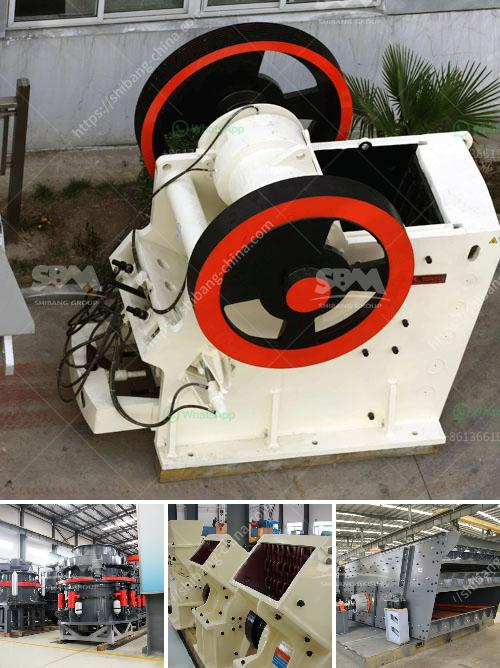

<h3>machinery for concrete crusher</h3>
When it comes to large-scale demolition projects, it’s crucial to have the right equipment on hand. Crushers are designed to break up concrete aggregates into more manageable pieces, making it easier to transport and recycle them. With the increased focus on sustainability and reducing waste, the use of machinery for concrete crushing has become increasingly popular. In this article, we will explore the benefits and functionality of these machines.

One of the primary advantages of using a concrete crusher is that it can handle various types of materials, ranging from asphalt to reinforced concrete. This versatility makes the machine incredibly useful on construction sites where different types of waste materials need to be managed effectively. By crushing concrete on-site, contractors can save on transportation costs, as the crushed materials can be reused as aggregate for new structures or pavement.

Machinery for concrete crushing typically comes in two main types: jaw crushers and impact crushers. Jaw crushers are used for the primary crushing of large chunks of concrete, while impact crushers are designed for secondary crushing to produce smaller particles. Both types of crushers work by compression, reducing the size of the material by squeezing it between two surfaces. However, impact crushers use a rotating rotor with hammers to achieve the desired result.

The benefits of using these machines go beyond cost savings and environmental considerations. Machinery for concrete crushing can significantly speed up the demolition process, allowing contractors to complete projects more efficiently. By utilizing machinery, crushing can be done on-site, reducing the need for transporting materials and consequently minimizing the risk of accidents or damage during transportation. Additionally, by avoiding off-site crushing, contractors can prevent the release of harmful particles into the air, ensuring a safer work environment for all involved.

Another advantage of using machinery for concrete crusher lies in its ability to handle different sizes of materials. With adjustable jaw openings and impact crusher settings, these machines can accommodate various material sizes, making them suitable for a wide range of projects. The adaptability of the machinery ensures that no material goes to waste and that it is crushed to the desired specifications.

Moreover, machinery for concrete crushing is designed with durability and reliability in mind. These heavy-duty machines are built to withstand tough conditions, such as the crushing of reinforced concrete or other highly abrasive materials. Their robust construction and quality components ensure longevity, minimizing downtime and maximizing productivity.

In conclusion, machinery for concrete crushing plays a vital role in demolition projects by efficiently breaking down waste materials into manageable sizes. Not only does it reduce transportation costs and environmental impact, but it also speeds up the demolition process, ensuring projects are completed on time. The adaptability of these machines to handle different materials and their durability further enhances their usefulness. As sustainable practices gain traction in the construction industry, the demand for machinery for concrete crushing is likely to continue to rise.
<h3>Contact us</h3><ul><li><strong>Whatsapp:&nbsp;<a href="https://wa.me/8613661969651">+8613661969651</a></strong></li><li><a href="https://swt.shibang-china.com/?git&amp;zhl&amp;machinery for concrete crusher"><strong>Online Service(chat now)</strong></a></li></ul><h3>Related</h3><ul><li><a href='how much crusher cost.md'>how much crusher cost</a></li><li><a href='old cement plant in india for sale.md'>old cement plant in india for sale</a></li><li><a href='hammer mill price in nigeria.md'>hammer mill price in nigeria</a></li><li><a href='crusher size 1 ton capacity hour.md'>crusher size 1 ton capacity hour</a></li><li><a href='rod mill manufacturer in europe.md'>rod mill manufacturer in europe</a></li></ul>