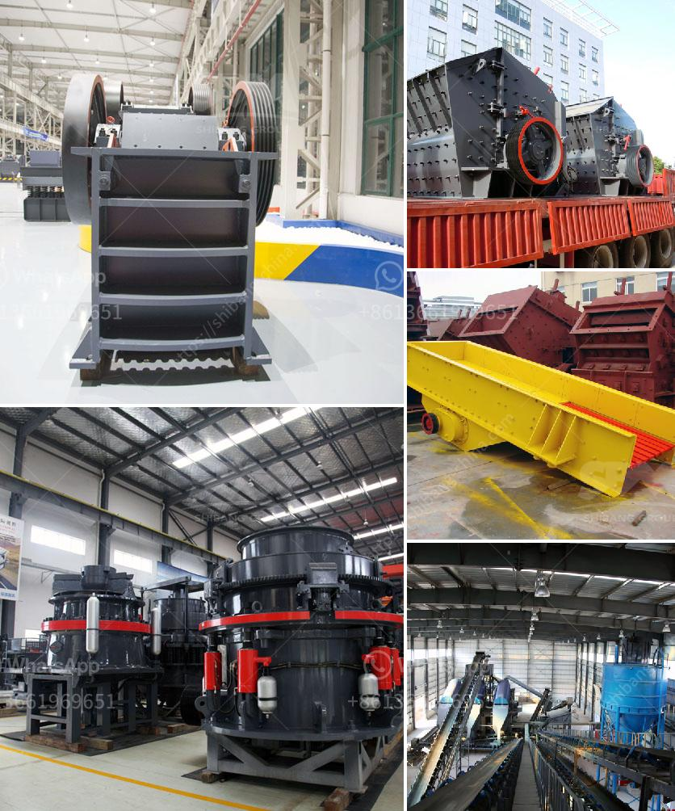

<h3>machinery needed for limestone extraction</h3>
Limestone extraction is a complex process that involves the use of heavy machinery to extract the rock formations beneath the surface. The machinery required for limestone extraction varies depending on the method used to remove the limestone from the deposits.

Large-scale quarrying operations use heavy equipment such as bulldozers and backhoes to dig out the limestone. These machines are collectively known as "surface miners" because they can extract the rock formations directly from the surface of the earth. This eliminates the need for blasting, which can be detrimental to the surrounding environment.

Surface miners can remove massive amounts of limestone in a single pass, making them highly efficient. They are equipped with cutting drums that can rip through the rock formations, reducing them to easily transportable pieces. These machines are also equipped with conveyor belts that can carry the extracted limestone to awaiting trucks or processing plants.

In some cases, underground mining is used to extract the limestone. Deep underground mines can be a vast network of tunnels that extend for miles. The machinery used in underground mining includes longwall machines, continuous miners, roof bolters, and shuttle cars. These machines work collaboratively to extract the limestone, ensuring maximum productivity and safety.

In addition to the machinery described above, various other equipment is required throughout the limestone extraction process. This includes crushers, screening machines, and dust control systems to minimize dust emissions from the limestone crushing and screening operations. It also includes conveyors, stackers, and reclaimers for efficient storage and transportation of the extracted limestone.

Overall, limestone extraction is a highly specialized process that requires heavy machinery and modern technology to ensure efficiency and safety. The machinery used in the extraction of limestone creates a significant impact on both the environment and the profitability of the operation. Thus, it is crucial for mining companies to carefully choose the appropriate machinery and implement sustainable practices to minimize the ecological footprint of limestone extraction.
<h3>Contact us</h3><ul><li><strong>Whatsapp:&nbsp;<a href="https://wa.me/8613661969651">+8613661969651</a></strong></li><li><a href="https://swt.shibang-china.com/?git&amp;zhl&amp;machinery needed for limestone extraction"><strong>Online Service(chat now)</strong></a></li></ul><h3>Related</h3><ul><li><a href='how to control partials size in vertical hammer mill.md'>how to control partials size in vertical hammer mill</a></li><li><a href='50 tph stone crusher price.md'>50 tph stone crusher price</a></li><li><a href='magnetita mineral cribado cantera planta trituradora.md'>magnetita mineral cribado cantera planta trituradora</a></li><li><a href='gold mining equipment from japan.md'>gold mining equipment from japan</a></li><li><a href='primary crusher meaning in hindi.md'>primary crusher meaning in hindi</a></li></ul>