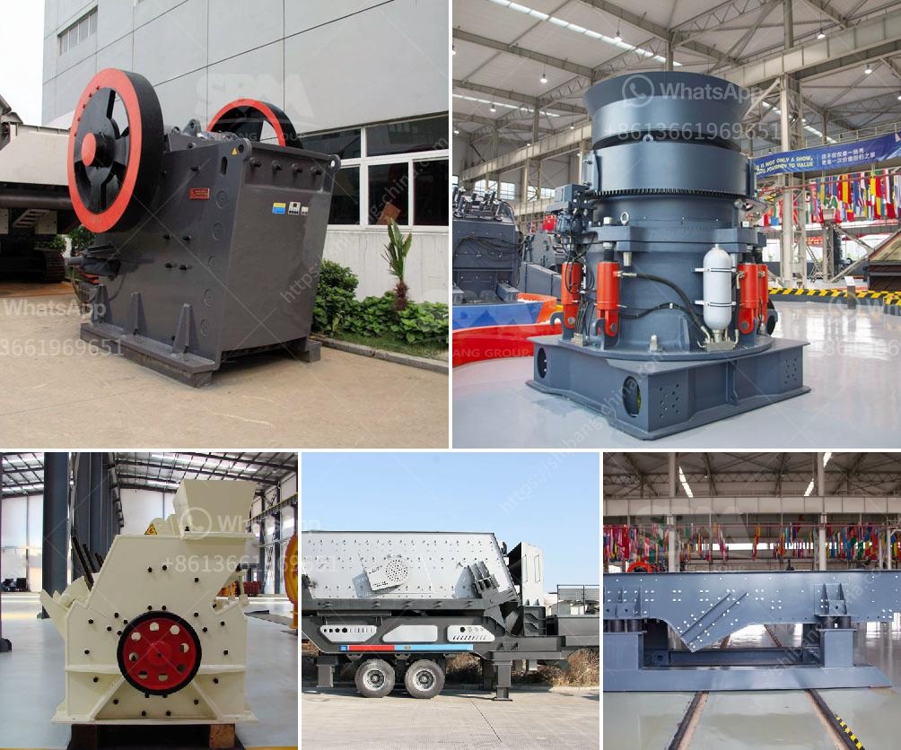

<h3>machines for quarrying of stones</h3>
Machines for quarrying stones are essential tools in the construction industry. Quarrying is the process of extracting stones from natural rock formations. Quarries are where these extracted stones are then further processed for various uses, such as in building roads, foundations, and bridges.

One of the most commonly used machines for quarrying stones is the excavator. This heavy-duty machine consists of a bucket attached to a hydraulic arm. It is used to dig and remove large quantities of stones from the quarry site. The excavator's versatility allows it to maneuver easily in tight spaces, making it efficient for stone extraction.

Another vital machine in stone quarrying is the crusher machine. It is used to crush large stones into smaller sizes for various construction purposes. Different types of crushers are available, including jaw crushers, impact crushers, and cone crushers. These machines help break down the extracted stones into desired sizes, enabling easier transportation and usage.

Additionally, there are specialized machines, such as wire saws and drilling machines, used in quarrying. Wire saws are used to cut through large blocks of stone, while drilling machines are used to create holes for inserting explosive materials during the extraction process. These machines contribute to the efficiency and accuracy of quarrying operations.

With advancements in technology, machines used for quarrying stones have become more advanced and automated. Computer-controlled systems, laser-guided machines, and remote-control operations have improved efficiency and safety in the quarrying industry. These technologies enable more precise cutting and drilling, reducing waste and increasing productivity.

In conclusion, machines for quarrying stones play a crucial role in the construction industry. They help extract, process, and prepare stones for various applications. From excavators to crushers and specialized machines like wire saws and drilling machines, these tools contribute to efficient and accurate operations. The continuous advancements in technology have further improved the capabilities of these machines, making quarrying processes safer and more productive.
<h3>Contact us</h3><ul><li><strong>Whatsapp:&nbsp;<a href="https://wa.me/8613661969651">+8613661969651</a></strong></li><li><a href="https://swt.shibang-china.com/?git&amp;zhl&amp;machines for quarrying of stones"><strong>Online Service(chat now)</strong></a></li></ul><h3>Related</h3><ul><li><a href='wet ball milling process.md'>wet ball milling process</a></li><li><a href='quarry crusher equipment suppliers miami.md'>quarry crusher equipment suppliers miami</a></li><li><a href='used washing gold plants for sale in europe.md'>used washing gold plants for sale in europe</a></li><li><a href='gypsum plant price.md'>gypsum plant price</a></li><li><a href='stone quarry crusher machines.md'>stone quarry crusher machines</a></li></ul>