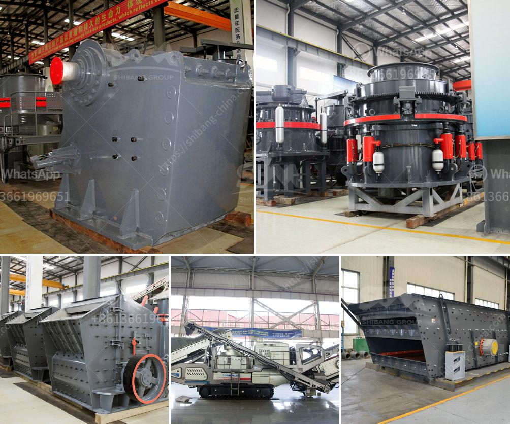

<h3>magnesite processing equipment price</h3>
Magnesite is a mineral that belongs to the carbonate group and is composed of magnesium, carbon, and oxygen. It is predominantly used in the production of magnesium oxide and refractory materials. With the growing demand for these applications, the price of magnesite processing equipment is an important consideration for businesses in the industry.

The price of magnesite processing equipment varies depending on several factors such as the processing capacity, the type of equipment, and the supplier. Generally, the larger the processing capacity, the higher the price of the equipment. Similarly, specialized equipment designed for specific processing methods or advanced features may also come at a higher cost.

For instance, a basic magnesite processing equipment with a smaller processing capacity, suitable for small-scale operations, could cost around $50,000 to $100,000. This equipment typically includes crushing and screening units, as well as magnetic separators and air classifiers for further purification and separation of magnesite ore.

On the other hand, large-scale magnesite processing plants with higher processing capacities and more advanced features can cost several million dollars. These plants often involve sophisticated equipment such as rotary kilns for calcination, flotation cells for ore concentration, and high-pressure grinding rolls for further ore beneficiation. The cost of these plants is justified by their ability to process large quantities of magnesite efficiently.

In addition to the processing capacity and features, the price of magnesite processing equipment is also influenced by the supplier. Different suppliers may offer varying prices for similar equipment due to differences in manufacturing and operational costs. It is important for businesses to research and compare prices from different suppliers to ensure they are getting the best value for their investment.

Another factor that affects the price of magnesite processing equipment is the overall market demand and supply. When the demand for magnesite is high, prices for the equipment may increase due to increased competition among buyers. Conversely, during periods of low demand, suppliers may offer discounts or incentives to attract customers.

Furthermore, the ongoing technological advancements in magnesite processing equipment can also affect its price. As new and improved equipment is developed, older models may become less expensive, making them a more cost-effective option for businesses. However, it is important to carefully evaluate the performance and efficiency of both new and old equipment to ensure they meet the specific processing requirements.

In conclusion, the price of magnesite processing equipment varies depending on factors such as processing capacity, features, supplier, market demand, and technological advancements. It is crucial for businesses in the magnesite industry to assess their processing needs and budget before investing in equipment. Comparing prices from different suppliers and considering the long-term benefits of advanced features can help businesses make an informed decision while optimizing their investment in the equipment.
<h3>Contact us</h3><ul><li><strong>Whatsapp:&nbsp;<a href="https://wa.me/8613661969651">+8613661969651</a></strong></li><li><a href="https://swt.shibang-china.com/?git&amp;zhl&amp;magnesite processing equipment price"><strong>Online Service(chat now)</strong></a></li></ul><h3>Related</h3><ul><li><a href='grinding machine types use in cement industry.md'>grinding machine types use in cement industry</a></li><li><a href='clay crusher manufacturing process.md'>clay crusher manufacturing process</a></li><li><a href='gold production process flow chart.md'>gold production process flow chart</a></li><li><a href='jaw crusher terminator.md'>jaw crusher terminator</a></li><li><a href='mobile diamond washing plant for sale.md'>mobile diamond washing plant for sale</a></li></ul>