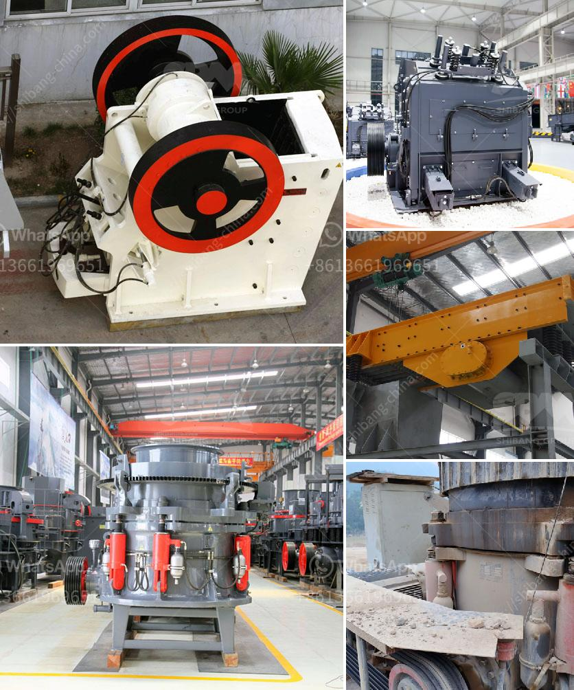

<h3>magnetic separator conveyor indonesia</h3>
Magnetic separator machine is used to remove iron in the coal, non-metallic processing, and ceramics industries. Magnetic separator is widely used in the mining industry to separate tramp ore’s, mixed with the magnetic material, into magnetic and non-magnetic materials.

In addition, coal magnetic separator is used to de-iron for coal, non-metal ore and building materials. So we can say that magnetic separator is one of the most widely used machines.

Two types of magnetic separators are dry magnetic separator and wet magnetic separator. And the wet magnetic separator is more commonly used. So the wet magnetic separator is more popular in Indonesia.

The dry magnetic separator is suitable for the separation of magnetite, pyrrhotite, roasted ore, ilmenite and other materials with a particle size of less than 3mm. It is also used for iron removal of coal, non-metallic minerals, building materials, etc. It is used in the ceramics industry to remove iron and improve the quality of raw materials. It is also used in the chemical industry to purify materials.

Meanwhile, the wet magnetic separator is most suitable for the separation of magnetite, pyrrhotite, calcined ore, ilmenite and other materials with a particle size of below 3mm. In addition, it is used for iron removal operations of coal, non-metallic minerals, building materials, and other materials. It can improve the quality of raw materials and is commonly used in the ceramic and chemical industries.

The magnetic separator conveyor belt products, including rubber conveyor belt and stainless steel conveyor belts, are supplied by us to various industries who are using machines like magnetic separator machinery, vibrating screen machinery etc.

Magnetic separator conveyor belt is fabricated using finest quality raw material, complying with international standards. Our magnetic separator conveyor belts are reliable, durable and provide trouble free service for a long time.

These conveyor belts are specially designed with a belt and magnet’s separator to separate magnetic materials from other materials. Keeping the diverse requirements of a customer in mind, we are involved in offering a wide range of magnetic separator conveyor belts.

Our magnetic separator conveyor belts are made using the highest quality raw materials and meet all industry standards for safety and efficiency. Ensuring that your conveyor belts are free from any impurities, they will reliably remove ferrous objects such as bolts, screws, and nails when passing through magnetic fields.

In conclusion, magnetic separators are used extensively in industries such as the mining and ceramics industry. Therefore, the magnetic separator conveyor belt has gained significant attention across various industries. These conveyor belts are reliable, durable, and provide trouble-free service for a long time.
<h3>Contact us</h3><ul><li><strong>Whatsapp:&nbsp;<a href="https://wa.me/8613661969651">+8613661969651</a></strong></li><li><a href="https://swt.shibang-china.com/?git&amp;zhl&amp;magnetic separator conveyor indonesia"><strong>Online Service(chat now)</strong></a></li></ul><h3>Related</h3><ul><li><a href='gold mining project proposal.md'>gold mining project proposal</a></li><li><a href='grinding mill for limestone.md'>grinding mill for limestone</a></li><li><a href='gold hammer mill used for sale in zimbabwe.md'>gold hammer mill used for sale in zimbabwe</a></li><li><a href='hammer mills produced in brazil.md'>hammer mills produced in brazil</a></li><li><a href='vertical impact crusher.md'>vertical impact crusher</a></li></ul>