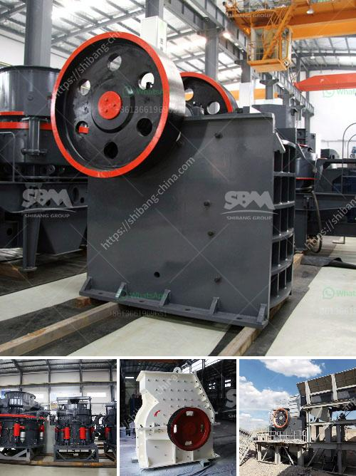

<h3>magnetita mineral cribado cantera planta trituradora</h3>
Magnetite Mineral Cribado Cantera Planta Trituradora: Unlocking the Potential of a Valuable Resource 

The mining industry plays a crucial role in the global economy, providing essential raw materials for various industries. As civilization advances, the demand for minerals continues to rise. One such valuable resource is magnetite, a type of iron oxide mineral that is highly sought after for its many applications. One of the key steps in harnessing the potential of magnetite is through the establishment of a cribado cantera planta trituradora, or a screening quarry crushing plant.

Magnetite is renowned for its magnetic properties, making it an important component in various industries such as steel production, automotive manufacturing, and electronics. It is used to produce high-quality steel, improving its strength and durability. Additionally, magnetite is utilized in the manufacturing of catalysts, pigments, and magnetic fluids. Given its wide array of applications, the need for a reliable and efficient magnetite screening quarry crushing plant becomes pivotal.

A cribado cantera planta trituradora is designed to extract and process magnetite in its raw form, ensuring that it meets the specific requirements of different industries. The process involves several stages, starting from the extraction of magnetite from the ground. This is typically done through blasting or other mining techniques, followed by the transport of the mineral to the screening quarry crushing plant.

Once at the plant, the magnetite undergoes a series of processes to separate it from other materials. This includes crushing, grinding, and screening, where state-of-the-art machinery is utilized to ensure maximum efficiency and productivity. The magnetite is screened to remove impurities and achieve the desired particle size for its intended application. This is crucial to produce a high-quality end product that meets the standards set by the industry.

The establishment of a cribado cantera planta trituradora not only benefits the mining industry but also the surrounding community. It provides employment opportunities for local residents, contributing to economic growth and development. Additionally, it stimulates other businesses in the area, such as transportation and logistics, thereby creating a ripple effect of economic prosperity.

Furthermore, a properly operated magnetite screening quarry crushing plant prioritizes environmental stewardship. Measures are put in place to minimize the plant's impact on the surrounding ecosystem. This includes the use of advanced filtration systems to prevent any contaminants from being released into the environment. Strict adherence to regulatory guidelines is enforced to ensure that the plant operates within the legal framework, promoting sustainable mining practices.

In conclusion, a cribado cantera planta trituradora is an essential facility in unlocking the potential of magnetite as a valuable resource. Through efficient extraction and processing, magnetite can be used in various industries, contributing to economic growth and development. By prioritizing environmental stewardship and complying with regulations, these plants can operate sustainably, minimizing their impact on the ecosystem. It is crucial for the mining industry to invest in such facilities to harness the full potential of magnetite and meet the growing global demand for this versatile mineral.
<h3>Contact us</h3><ul><li><strong>Whatsapp:&nbsp;<a href="https://wa.me/8613661969651">+8613661969651</a></strong></li><li><a href="https://swt.shibang-china.com/?git&amp;zhl&amp;magnetita mineral cribado cantera planta trituradora"><strong>Online Service(chat now)</strong></a></li></ul><h3>Related</h3><ul><li><a href='magnetic separator conveyor indonesia.md'>magnetic separator conveyor indonesia</a></li><li><a href='mobile jaw crusher.md'>mobile jaw crusher</a></li><li><a href='talcum powder mill manufacturing.md'>talcum powder mill manufacturing</a></li><li><a href='material used in vertical mill.md'>material used in vertical mill</a></li><li><a href='hydraulic stone crusher for hire uk.md'>hydraulic stone crusher for hire uk</a></li></ul>